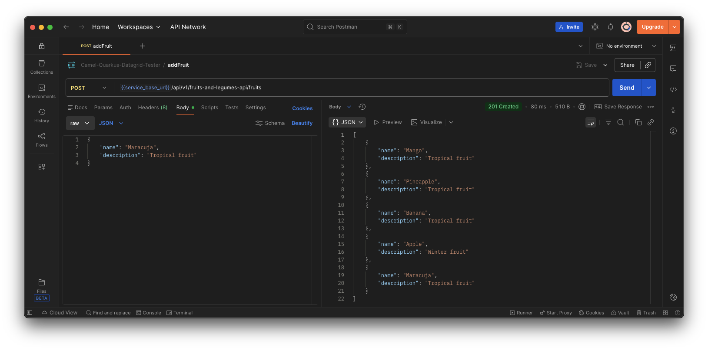

# Camel-Quarkus-Datagrid-Tester Project

This project leverages [**Red Hat build of Quarkus 3.27.x**](https://docs.redhat.com/en/documentation/red_hat_build_of_quarkus/3.27), the Supersonic Subatomic Java Framework. More specifically, the project is implemented using [**Red Hat build of Apache Camel v4.14.x for Quarkus**](https://docs.redhat.com/en/documentation/red_hat_build_of_apache_camel/4.14#Red%20Hat%20build%20of%20Apache%20Camel%20for%20Quarkus).

The purpose is to demo the implementation of the _Infinispan Idempotent Repository_ to synchronize concurrent access as well as the use of the _Apache Camel Quarkus Infinispan_ extension.

The following REST endpoints are exposed:
- `/api/v1/fruits-and-legumes-api/fruits` : 
    - `GET` returns a list of hard-coded and added fruits.
    - `POST` adds a fruit in the list of fruits.
- `/api/v1/fruits-and-legumes-api/legumes` :
    - Only `GET` method is supported. Returns a list of hard-coded legumes
- `/api/v1/minio-file-uploader-service/csv` :
    - Only `POST`method is supported. Uploads the fruits.csv file to MinIO server.
- `/api/v1/minio-file-uploader-service/json` :
    - Only `POST`method is supported. Uploads the fruits.json file to MinIO server.
- `/api/v1/minio-file-uploader-service/xml` :
    - Only `POST`method is supported. Uploads the fruits.xml file to MinIO server.
- `/q/openapi` _on a separate management interface (port **9876**)_ : returns the Open API Schema document of the service.
- `/q/swagger-ui` _on a separate management interface (port **9876**)_ :  opens the Open API UI.
- `/observe/health` _on a separate management interface (port **9876**)_ : returns the _Camel Quarkus MicroProfile_ health checks.
- `/observe/metrics` _on a separate management interface (port **9876**)_ : the _Camel Quarkus Micrometer_ metrics in prometheus format.

## Prerequisites

- Apache Maven 3.9.9
- JDK 21 installed with `JAVA_HOME` configured appropriately
- A running [_Red Hat OpenShift 4_](https://access.redhat.com/documentation/en-us/openshift_container_platform) cluster
- A running [_Red Hat Data Grid v8.5_](https://docs.redhat.com/en/documentation/red_hat_data_grid/8.5) cluster. 
    >_**NOTE**_: The [`config/datagrid`](./config/datagrid) folder contains OpenShift _Cache Custom Resources_ to be created. For instance, the following command line would create the `fruits-legumes-replicated-cache` and `idempotency-replicated-cache` replicated caches if the _Red Hat Data Grid_ cluster is deployed in the `datagrid-cluster` namespace: `oc -n datagrid-cluster apply -f ./config/datagrid`
    - [`fruits-legumes-replicated-cache-definition`](./config/datagrid/fruits-legumes-replicated-cache_cr.yaml) : `fruits-legumes-replicated-cache` used by the [`FruitsAndLegumesAPI`](./src/main/java/io/jeannyil/routes/FruitsAndLegumesApiRoute.java).
    - [`idempotency-replicated-cache-definition`](./config/datagrid/idempotency-replicated-cache_cr.yaml) : `idempotency-replicated-cache` used for idempotency purposes by the [`FilePollerRoute`](./src/main/java/io/jeannyil/routes/FilePollerRoute.java).
- A running [MinIO](https://min.io/) server to provide object storage used by the idempotent consumer route.
    >_**NOTE**_: The [`config/minio`](./config/minio/) folder contains resources to deploy a simple MinIO server in the `ceq-services-jvm` namespace on OpenShift.
    - You can run a simple MinIO server locally in container with the following `podman` instructions:
        1. Create the podman volume to persist MinIO data:
            ```shell
            podman volume create minio-data
            ```
        2. Run the MinIO container:
            ```shell
            podman run -d --name minio \
            -p 9000:9000 \
            -p 9090:9090 \
            -v minio-data:/data \
            -e "MINIO_ROOT_USER=minioadmin" \
            -e "MINIO_ROOT_PASSWORD=d-XT,YJ.XF3c_WT[" \
            quay.io/minio/minio server /data --console-address ":9090"
            ```
            - The MinIO administration web console is then available at http://localhost:9090/login
            - The MinIO API endpoint is also available at http://localhost:9000
- A truststore containing the [_Red Hat Data Grid v8.5_](https://docs.redhat.com/en/documentation/red_hat_data_grid/8.5) server public certificate. Below are sample command lines to generate one:
    ```shell
    # Use the Java cacerts as the basis for the truststore
    cp ${JAVA_HOME}/lib/security/cacerts ./tls-keys/truststore.p12
    keytool -storepasswd -keystore ./tls-keys/truststore.p12 -storepass changeit -new 'P@ssw0rd'
    # Importing the Red Hat Data Grid server public certificate into the truststore
    keytool -importcert -trustcacerts -keystore ./tls-keys/truststore.p12 -file ./tls-keys/rhdg.fullchain.pem -storepass P@ssw0rd -v -noprompt
    ```

    > :bulb: **Example on how to obtain the Red Hat Data Grid server public certificate:**
    ```shell
    openssl s_client -showcerts -servername <Red Hat Data Grid cluster OpenShift route> -connect <Red Hat Data Grid cluster OpenShift route>:443 | sed -ne '/-BEGIN CERTIFICATE-/,/-END CERTIFICATE-/p'
    ```
    with `<Red Hat Data Grid cluster OpenShift route>`: OpenShift route hostname for the Red Hat Data Grid cluster. E.g.: `datagrid.apps.ocp4.jnyilimb.eu`

## Running the application in dev mode

You can run your application in dev mode that enables live coding using:
```shell
./mvnw clean compile quarkus:dev
```

> **_NOTE:_**  Quarkus now ships with a Dev UI, which is available in dev mode only at http://localhost:8080/q/dev-ui.

## Packaging and running the application

The application can be packaged using:
```shell
./mvnw clean package
```
It produces the `quarkus-run.jar` file in the `target/quarkus-app/` directory.
Be aware that it’s not an _über-jar_ as the dependencies are copied into the `target/quarkus-app/lib/` directory.

The application is now runnable using:
```shell
java -Dquarkus.kubernetes-config.enabled=false -jar target/quarkus-app/quarkus-run.jar
```

If you want to build an _über-jar_, execute the following command:
```shell
./mvnw package -Dquarkus.package.type=uber-jar
```

The application, packaged as an _über-jar_, is now runnable using:
```shell
java -Dquarkus.kubernetes-config.enabled=false -jar target/*-runner.jar`
```

## Packaging and running the application on Red Hat OpenShift

### Prerequisites

- The `fruits-legumes-replicated-cache` and `idempotency-replicated-cache` caches have been created in the _Red Hat Data Grid_ cluster.

    >_**NOTE**_: The [`config/datagrid`](./config/datagrid) folder contains OpenShift _Cache Custom Resources_ to be created. For instance, the following command line would create the `fruits-legumes-replicated-cache` and `idempotency-replicated-cache` replicated caches if the _Red Hat Data Grid_ cluster is deployed in the `datagrid-cluster` namespace: `oc -n datagrid-cluster apply -f ./config/datagrid`

- The MinIO server 

### Instructions

1. Login to the OpenShift cluster:
    ```shell
    oc login ...
    ```

2. Create an OpenShift project to host the service:
    ```shell
    oc new-project ceq-services-jvm --display-name="Red Hat build of Apache Camel for Quarkus Apps - JVM Mode"
    ```

3. Deploy the simple MinIO server if not already deployed:
    ```shell
    oc apply -f ./config/minio
    ```

4. Create an `allInOne` Jaeger instance.
    1. **IF NOT ALREADY INSTALLED**:
        1. Install, via OLM, the `Red Hat OpenShift distributed tracing platform` (Jaeger) operator with an `AllNamespaces` scope. :warning: Needs `cluster-admin` privileges
            ```shell
            oc create --save-config -f - <<EOF
            apiVersion: operators.coreos.com/v1alpha1
            kind: Subscription
            metadata:
                name: jaeger-product
                namespace: openshift-operators
            spec:
                channel: stable
                installPlanApproval: Automatic
                name: jaeger-product
                source: redhat-operators
                sourceNamespace: openshift-marketplace
            EOF
            ```
        2. Verify the successful installation of the `Red Hat OpenShift distributed tracing platform` operator
            ```shell
            watch oc get sub,csv
            ```
    2. Create the `allInOne` Jaeger instance.
        ```shell
        oc create --save-config -f - <<EOF
        apiVersion: jaegertracing.io/v1
        kind: Jaeger
        metadata:
            name: jaeger-all-in-one-inmemory
        spec:
            allInOne:
                options:
                log-level: info
            strategy: allInOne
        EOF
        ```

5. Create secret containing the camel-quarkus-datagrid-tester truststore

    a. With custom certificates

    > :white_check_mark: USE THIS

    ```
    oc create secret generic camel-quarkus-datagrid-tester-truststore-secret --from-file=./tls-keys/truststore.p12
    ```

    b. **OPTIONAL:** With OpenShift signed certificates
    
    >:bulb: THIS IS FOR INFORMATION PURPOSES ONLY

    ```
    oc get secrets/signing-key -n openshift-service-ca -o template='{{index .data "tls.crt"}}' | openssl base64 -d -A > ./tls-keys/server.crt
    # Use the Java cacerts as the basis for the truststore
    cp ${JAVA_HOME}/lib/security/cacerts ./tls-keys/truststore.p12
    keytool -storepasswd -keystore ./tls-keys/truststore.p12 -storepass changeit -new 'P@ssw0rd'
    # Importing the OpenShift signing service certificate into the truststore
    keytool -importcert -keystore ./tls-keys/truststore.p12 -storepass 'P@ssw0rd' -file ./tls-keys/server.crt -trustcacerts -noprompt
    # Create camel-quarkus-datagrid-tester-truststore-secret
    oc create secret generic camel-quarkus-datagrid-tester-truststore-secret --from-file=./tls-keys/truststore.p12
    ```

6. Deploy to OpenShift using the _**S2I binary workflow**_
    ```shell
    ./mvnw clean package -Dquarkus.openshift.deploy=true
    ```

## Testing the application on OpenShift

1. Get the OpenShift route hostname
    ```shell
    URL="https://$(oc get route camel-quarkus-datagrid-tester -o jsonpath='{.spec.host}')"
    ```
2. Test the `/api/v1/fruits-and-legumes-api/legumes` endpoint
    ```shell
    curl $URL/api/v1/fruits-and-legumes-api/legumes | jq
    ```
    ```json
    [
    {
        "name": "Carrot",
        "description": "Root vegetable, usually orange"
    },
    {
        "name": "Zucchini",
        "description": "Summer squash"
    }
    ]
    ```
3. Test the `/api/v1/fruits-and-legumes-api/fruits` endpoint
    - `GET`:
        ```shell
        curl $URL/api/v1/fruits-and-legumes-api/fruits | jq
        ```
        ```json
        [
        {
            "name": "Apple",
            "description": "Winter fruit"
        },
        {
            "name": "Pineapple",
            "description": "Tropical fruit"
        },
        {
            "name": "Mango",
            "description": "Tropical fruit"
        },
        {
            "name": "Banana",
            "description": "Tropical fruit"
        }
        ]
        ```
    - `POST`:
        ```shell
        curl -X 'POST' $URL/api/v1/fruits-and-legumes-api/fruits \
        -H 'accept: application/json' \
        -H 'Content-Type: application/json' \
        -d '{
        "name": "Maracuja",
        "description": "Tropical fruit :-)"
        }' | jq
        ```
        ```json
        [
        {
            "name": "Mango",
            "description": "Tropical fruit"
        },
        {
            "name": "Pineapple",
            "description": "Tropical fruit"
        },
        {
            "name": "Banana",
            "description": "Tropical fruit"
        },
        {
            "name": "Apple",
            "description": "Winter fruit"
        },
        {
            "name": "Maracuja",
            "description": "Tropical fruit :-)"
        }
        ]
        ```

## Testing using [Postman](https://www.postman.com/)

Import the provided Postman Collection for testing: [tests/Camel-Quarkus-Datagrid-Tester.postman_collection.json](./tests/Camel-Quarkus-Datagrid-Tester.postman_collection.json)
 


## Creating a native executable

You can create a native executable using the following command:

```shell
./mvnw clean package -Pnative -Dquarkus.native.native-image-xmx=7g
```

>**NOTE** : The project is configured to use a container runtime for native builds. See `quarkus.native.container-build=true` in the [`application.yml`](./src/main/resources/application.yml). Also, adjust the `quarkus.native.native-image-xmx` value according to your container runtime available memory resources.

You can then execute your native executable with: `./target/camel-quarkus-datagrid-tester-1.0.0-runner`

If you want to learn more about building native executables, please consult https://quarkus.io/guides/building-native-image.

>**NOTE** : If your are on Apple Silicon and built the native image inside a Linux container (-Dquarkus.native.container-build=true), the result is a Linux ELF binary. macOS can’t execute Linux binaries, so launching it on macOS yields “exec format error”. Follow the steps below to run your Linux native binary.

1. Build the container image of your Linux native binary:
    ```shell
    podman build -f src/main/docker/Dockerfile.native -t camel-quarkus-datagrid-tester .
    ```
2. Run the container:
    ```shell
    podman run --rm --name camel-quarkus-datagrid-tester \
    -p 8080:8080,9876:9876 \
    -e QUARKUS_KUBERNETES-CONFIG_ENABLED=false \
    -e QUARKUS_OTEL_EXPORTER_OTLP_ENDPOINT=http://host.containers.internal:4317 \
    -e QUARKUS_INFINISPAN_CLIENT_TRUST-STORE=/mnt/ssl/truststore.p12 \
    -e MINIO_ENDPOINT=http://host.containers.internal:9000 \
    -v ./tls-keys/truststore.p12:/mnt/ssl/truststore.p12:ro \
    camel-quarkus-datagrid-tester
    ```
## Start-up time comparison in the same environment

Used environment:
- **Laptop**: MacBook PRO
- **CPU**: Apple M2 PRO
- **RAM**: 32Gb
- **Container runtime for native builds**: podman v5.7.0

### JVM mode -> _started in **2.119s**_

```shell
# java -Dquarkus.kubernetes-config.enabled=false -jar target/quarkus-app/quarkus-run.jar
[...]
2025-11-27 15:12:21,586 INFO  traceId=, parentId=, spanId=, sampled= [or.ap.ca.im.en.AbstractCamelContext] (main) Apache Camel 4.14.0.redhat-00009 (camel-quarkus-datagrid-tester) is starting
2025-11-27 15:12:21,641 INFO  traceId=, parentId=, spanId=, sampled= [or.ap.ca.op.OpenTelemetryTracer] (main) OpenTelemetryTracer enabled using instrumentation-name: camel
2025-11-27 15:12:21,642 INFO  traceId=, parentId=, spanId=, sampled= [or.ap.ca.im.en.AbstractCamelContext] (main) Using ThreadPoolFactory: org.apache.camel.opentelemetry.OpenTelemetryInstrumentedThreadPoolFactory@4d192aef
2025-11-27 15:12:21,915 INFO  traceId=, parentId=, spanId=, sampled= [or.ap.ca.ma.BaseMainSupport] (main) Property-placeholders summary
2025-11-27 15:12:21,916 INFO  traceId=, parentId=, spanId=, sampled= [or.ap.ca.ma.BaseMainSupport] (main)     [MicroProfilePropertiesSource] datagrid.caches.fruits-legumes = fruits-legumes-replicated-cache
2025-11-27 15:12:21,916 INFO  traceId=, parentId=, spanId=, sampled= [or.ap.ca.ma.BaseMainSupport] (main)     [MicroProfilePropertiesSource] minio.endpoint = http://localhost:9000
2025-11-27 15:12:21,916 INFO  traceId=, parentId=, spanId=, sampled= [or.ap.ca.ma.BaseMainSupport] (main)     [MicroProfilePropertiesSource] minio.access-key = xxxxxx
2025-11-27 15:12:21,916 INFO  traceId=, parentId=, spanId=, sampled= [or.ap.ca.ma.BaseMainSupport] (main)     [MicroProfilePropertiesSource] minio.secret-key = xxxxxx
2025-11-27 15:12:21,916 INFO  traceId=, parentId=, spanId=, sampled= [or.ap.ca.ma.BaseMainSupport] (main)     [MicroProfilePropertiesSource] minio.bucket-name = camel-quarkus-datagrid-tester
2025-11-27 15:12:21,917 INFO  traceId=, parentId=, spanId=, sampled= [or.ap.ca.im.en.AbstractCamelContext] (main) Routes startup (total:17 rest-dsl:1)
2025-11-27 15:12:21,917 INFO  traceId=, parentId=, spanId=, sampled= [or.ap.ca.im.en.AbstractCamelContext] (main)     Started put-fruits-in-cache-route (direct://put-fruits-in-cache)
2025-11-27 15:12:21,917 INFO  traceId=, parentId=, spanId=, sampled= [or.ap.ca.im.en.AbstractCamelContext] (main)     Started putifabsent-fruits-in-cache-route (direct://putifabsent-fruits-in-cache)
2025-11-27 15:12:21,917 INFO  traceId=, parentId=, spanId=, sampled= [or.ap.ca.im.en.AbstractCamelContext] (main)     Started get-fruits-from-cache-route (direct://get-fruits-from-cache)
2025-11-27 15:12:21,918 INFO  traceId=, parentId=, spanId=, sampled= [or.ap.ca.im.en.AbstractCamelContext] (main)     Started put-legumes-in-cache-route (direct://put-legumes-in-cache)
2025-11-27 15:12:21,918 INFO  traceId=, parentId=, spanId=, sampled= [or.ap.ca.im.en.AbstractCamelContext] (main)     Started putifabsent-legumes-in-cache-route (direct://putifabsent-legumes-in-cache)
2025-11-27 15:12:21,918 INFO  traceId=, parentId=, spanId=, sampled= [or.ap.ca.im.en.AbstractCamelContext] (main)     Started get-legumes-from-cache-route (direct://get-legumes-from-cache)
2025-11-27 15:12:21,918 INFO  traceId=, parentId=, spanId=, sampled= [or.ap.ca.im.en.AbstractCamelContext] (main)     Started fruits-legumes-cache-init-route (timer://once)
2025-11-27 15:12:21,918 INFO  traceId=, parentId=, spanId=, sampled= [or.ap.ca.im.en.AbstractCamelContext] (main)     Started getFruits (direct://getFruits)
2025-11-27 15:12:21,918 INFO  traceId=, parentId=, spanId=, sampled= [or.ap.ca.im.en.AbstractCamelContext] (main)     Started addFruit (direct://addFruit)
2025-11-27 15:12:21,918 INFO  traceId=, parentId=, spanId=, sampled= [or.ap.ca.im.en.AbstractCamelContext] (main)     Started getLegumes (direct://getLegumes)
2025-11-27 15:12:21,919 INFO  traceId=, parentId=, spanId=, sampled= [or.ap.ca.im.en.AbstractCamelContext] (main)     Started generate-error-response-route (direct://generateErrorResponse)
2025-11-27 15:12:21,919 INFO  traceId=, parentId=, spanId=, sampled= [or.ap.ca.im.en.AbstractCamelContext] (main)     Started generate-ok-response-route (direct://generateOKResponse)
2025-11-27 15:12:21,919 INFO  traceId=, parentId=, spanId=, sampled= [or.ap.ca.im.en.AbstractCamelContext] (main)     Started uploadCsvFile (direct://uploadCsvFile)
2025-11-27 15:12:21,919 INFO  traceId=, parentId=, spanId=, sampled= [or.ap.ca.im.en.AbstractCamelContext] (main)     Started uploadJsonFile (direct://uploadJsonFile)
2025-11-27 15:12:21,919 INFO  traceId=, parentId=, spanId=, sampled= [or.ap.ca.im.en.AbstractCamelContext] (main)     Started uploadXmlFile (direct://uploadXmlFile)
2025-11-27 15:12:21,919 INFO  traceId=, parentId=, spanId=, sampled= [or.ap.ca.im.en.AbstractCamelContext] (main)     Started route1 (rest-openapi://classpath:META-INF/openapi.yaml)
2025-11-27 15:12:21,919 INFO  traceId=, parentId=, spanId=, sampled= [or.ap.ca.im.en.AbstractCamelContext] (main)     Started minio-consumer-route (minio://camel-quarkus-datagrid-tester)
2025-11-27 15:12:21,919 INFO  traceId=, parentId=, spanId=, sampled= [or.ap.ca.im.en.AbstractCamelContext] (main) Apache Camel 4.14.0.redhat-00009 (camel-quarkus-datagrid-tester) started in 332ms (build:0ms init:0ms start:332ms boot:1s368ms)
2025-11-27 15:12:21,946 INFO  traceId=, parentId=, spanId=, sampled= [io.quarkus] (main) camel-quarkus-datagrid-tester 1.0.0 on JVM (powered by Quarkus 3.27.0.redhat-00001) started in 2.119s. Listening on: http://0.0.0.0:8080. Management interface listening on http://0.0.0.0:9876.
2025-11-27 15:12:21,946 INFO  traceId=, parentId=, spanId=, sampled= [io.quarkus] (main) Profile prod activated. 
2025-11-27 15:12:21,947 INFO  traceId=, parentId=, spanId=, sampled= [io.quarkus] (main) Installed features: [camel-attachments, camel-bean, camel-core, camel-direct, camel-infinispan, camel-jackson, camel-jolokia, camel-log, camel-management, camel-micrometer, camel-microprofile-health, camel-minio, camel-observability-services, camel-opentelemetry, camel-platform-http, camel-rest, camel-rest-openapi, camel-timer, camel-xml-io-dsl, cdi, config-yaml, infinispan-client, kubernetes, kubernetes-client, micrometer, opentelemetry, rest, smallrye-context-propagation, smallrye-health, smallrye-openapi, swagger-ui, vertx]
```

### Native mode -> _started in **0.348s**_

```shell
# podman run --rm --name camel-quarkus-datagrid-tester -p 8080:8080,9876:9876 -e QUARKUS_KUBERNETES-CONFIG_ENABLED=false -e QUARKUS_OTEL_EXPORTER_OTLP_ENDPOINT=http://host.containers.internal:4317 -e QUARKUS_INFINISPAN_CLIENT_TRUST-STORE=/mnt/ssl/truststore.p12 -e MINIO_ENDPOINT=http://host.containers.internal:9000 -v ./tls-keys/truststore.p12:/mnt/ssl/truststore.p12:ro camel-quarkus-datagrid-tester
[...]
2025-11-27 14:13:02,846 INFO  traceId=, parentId=, spanId=, sampled= [or.ap.ca.im.en.AbstractCamelContext] (main) Apache Camel 4.14.0.redhat-00009 (camel-quarkus-datagrid-tester) is starting
2025-11-27 14:13:02,860 INFO  traceId=, parentId=, spanId=, sampled= [or.ap.ca.op.OpenTelemetryTracer] (main) OpenTelemetryTracer enabled using instrumentation-name: camel
2025-11-27 14:13:02,860 INFO  traceId=, parentId=, spanId=, sampled= [or.ap.ca.im.en.AbstractCamelContext] (main) Using ThreadPoolFactory: org.apache.camel.opentelemetry.OpenTelemetryInstrumentedThreadPoolFactory@5f26cb8b
2025-11-27 14:13:03,017 INFO  traceId=, parentId=, spanId=, sampled= [or.ap.ca.ma.BaseMainSupport] (main) Property-placeholders summary
2025-11-27 14:13:03,017 INFO  traceId=, parentId=, spanId=, sampled= [or.ap.ca.ma.BaseMainSupport] (main)     [MicroProfilePropertiesSource] datagrid.caches.fruits-legumes = fruits-legumes-replicated-cache
2025-11-27 14:13:03,017 INFO  traceId=, parentId=, spanId=, sampled= [or.ap.ca.ma.BaseMainSupport] (main)     [OS Environment Variable]      minio.endpoint = http://host.containers.internal:9000
2025-11-27 14:13:03,017 INFO  traceId=, parentId=, spanId=, sampled= [or.ap.ca.ma.BaseMainSupport] (main)     [MicroProfilePropertiesSource] minio.access-key = xxxxxx
2025-11-27 14:13:03,017 INFO  traceId=, parentId=, spanId=, sampled= [or.ap.ca.ma.BaseMainSupport] (main)     [MicroProfilePropertiesSource] minio.secret-key = xxxxxx
2025-11-27 14:13:03,017 INFO  traceId=, parentId=, spanId=, sampled= [or.ap.ca.ma.BaseMainSupport] (main)     [MicroProfilePropertiesSource] minio.bucket-name = camel-quarkus-datagrid-tester
2025-11-27 14:13:03,018 INFO  traceId=, parentId=, spanId=, sampled= [or.ap.ca.im.en.AbstractCamelContext] (main) Routes startup (total:17 rest-dsl:1)
2025-11-27 14:13:03,018 INFO  traceId=, parentId=, spanId=, sampled= [or.ap.ca.im.en.AbstractCamelContext] (main)     Started put-fruits-in-cache-route (direct://put-fruits-in-cache)
2025-11-27 14:13:03,018 INFO  traceId=, parentId=, spanId=, sampled= [or.ap.ca.im.en.AbstractCamelContext] (main)     Started putifabsent-fruits-in-cache-route (direct://putifabsent-fruits-in-cache)
2025-11-27 14:13:03,018 INFO  traceId=, parentId=, spanId=, sampled= [or.ap.ca.im.en.AbstractCamelContext] (main)     Started get-fruits-from-cache-route (direct://get-fruits-from-cache)
2025-11-27 14:13:03,018 INFO  traceId=, parentId=, spanId=, sampled= [or.ap.ca.im.en.AbstractCamelContext] (main)     Started put-legumes-in-cache-route (direct://put-legumes-in-cache)
2025-11-27 14:13:03,018 INFO  traceId=, parentId=, spanId=, sampled= [or.ap.ca.im.en.AbstractCamelContext] (main)     Started putifabsent-legumes-in-cache-route (direct://putifabsent-legumes-in-cache)
2025-11-27 14:13:03,018 INFO  traceId=, parentId=, spanId=, sampled= [or.ap.ca.im.en.AbstractCamelContext] (main)     Started get-legumes-from-cache-route (direct://get-legumes-from-cache)
2025-11-27 14:13:03,018 INFO  traceId=, parentId=, spanId=, sampled= [or.ap.ca.im.en.AbstractCamelContext] (main)     Started fruits-legumes-cache-init-route (timer://once)
2025-11-27 14:13:03,018 INFO  traceId=, parentId=, spanId=, sampled= [or.ap.ca.im.en.AbstractCamelContext] (main)     Started getFruits (direct://getFruits)
2025-11-27 14:13:03,018 INFO  traceId=, parentId=, spanId=, sampled= [or.ap.ca.im.en.AbstractCamelContext] (main)     Started addFruit (direct://addFruit)
2025-11-27 14:13:03,018 INFO  traceId=, parentId=, spanId=, sampled= [or.ap.ca.im.en.AbstractCamelContext] (main)     Started getLegumes (direct://getLegumes)
2025-11-27 14:13:03,018 INFO  traceId=, parentId=, spanId=, sampled= [or.ap.ca.im.en.AbstractCamelContext] (main)     Started generate-error-response-route (direct://generateErrorResponse)
2025-11-27 14:13:03,018 INFO  traceId=, parentId=, spanId=, sampled= [or.ap.ca.im.en.AbstractCamelContext] (main)     Started generate-ok-response-route (direct://generateOKResponse)
2025-11-27 14:13:03,018 INFO  traceId=, parentId=, spanId=, sampled= [or.ap.ca.im.en.AbstractCamelContext] (main)     Started uploadCsvFile (direct://uploadCsvFile)
2025-11-27 14:13:03,018 INFO  traceId=, parentId=, spanId=, sampled= [or.ap.ca.im.en.AbstractCamelContext] (main)     Started uploadJsonFile (direct://uploadJsonFile)
2025-11-27 14:13:03,018 INFO  traceId=, parentId=, spanId=, sampled= [or.ap.ca.im.en.AbstractCamelContext] (main)     Started uploadXmlFile (direct://uploadXmlFile)
2025-11-27 14:13:03,018 INFO  traceId=, parentId=, spanId=, sampled= [or.ap.ca.im.en.AbstractCamelContext] (main)     Started route1 (rest-openapi://classpath:META-INF/openapi.yaml)
2025-11-27 14:13:03,018 INFO  traceId=, parentId=, spanId=, sampled= [or.ap.ca.im.en.AbstractCamelContext] (main)     Started minio-consumer-route (minio://camel-quarkus-datagrid-tester)
2025-11-27 14:13:03,018 INFO  traceId=, parentId=, spanId=, sampled= [or.ap.ca.im.en.AbstractCamelContext] (main) Apache Camel 4.14.0.redhat-00009 (camel-quarkus-datagrid-tester) started in 172ms (build:0ms init:0ms start:172ms)
2025-11-27 14:13:03,019 INFO  traceId=, parentId=, spanId=, sampled= [io.quarkus] (main) camel-quarkus-datagrid-tester 1.0.0 native (powered by Quarkus 3.27.0.redhat-00001) started in 0.348s. Listening on: http://0.0.0.0:8080. Management interface listening on http://0.0.0.0:9876.
2025-11-27 14:13:03,019 INFO  traceId=, parentId=, spanId=, sampled= [io.quarkus] (main) Profile prod activated. 
2025-11-27 14:13:03,019 INFO  traceId=, parentId=, spanId=, sampled= [io.quarkus] (main) Installed features: [camel-attachments, camel-bean, camel-core, camel-direct, camel-infinispan, camel-jackson, camel-jolokia, camel-log, camel-management, camel-micrometer, camel-microprofile-health, camel-minio, camel-observability-services, camel-opentelemetry, camel-platform-http, camel-rest, camel-rest-openapi, camel-timer, camel-xml-io-dsl, cdi, config-yaml, infinispan-client, kubernetes, kubernetes-client, micrometer, opentelemetry, rest, smallrye-context-propagation, smallrye-health, smallrye-openapi, swagger-ui, vertx]
```