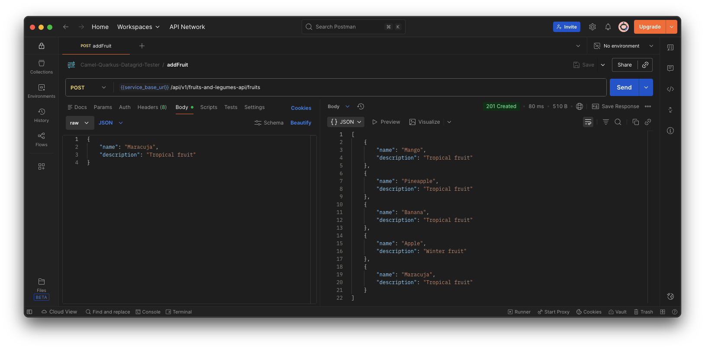

# Camel-Quarkus-Datagrid-Tester Project

This project leverages [**Red Hat build of Quarkus 3.33.x**](https://docs.redhat.com/en/documentation/red_hat_build_of_quarkus/3.33), the Supersonic Subatomic Java Framework. More specifically, the project is implemented using [**Red Hat build of Apache Camel v4.18.x for Quarkus**](https://docs.redhat.com/en/documentation/red_hat_build_of_apache_camel/4.18#Red%20Hat%20build%20of%20Apache%20Camel%20for%20Quarkus).

The purpose is to demo the implementation of the _Infinispan Idempotent Repository_ to synchronize concurrent access as well as the use of the _Apache Camel Quarkus Infinispan_ extension.

The following REST endpoints are exposed:
- `/api/v1/fruits-and-legumes-api/fruits` : 
    - `GET` returns a list of hard-coded and added fruits.
    - `POST` adds a fruit in the list of fruits.
- `/api/v1/fruits-and-legumes-api/legumes` :
    - Only `GET` method is supported. Returns a list of hard-coded legumes
- `/api/v1/s3-file-uploader-service/csv` :
    - Only `POST` method is supported. Uploads the fruits.csv file to S3-compatible object storage.
- `/api/v1/s3-file-uploader-service/json` :
    - Only `POST` method is supported. Uploads the fruits.json file to S3-compatible object storage.
- `/api/v1/s3-file-uploader-service/xml` :
    - Only `POST` method is supported. Uploads the fruits.xml file to S3-compatible object storage.
- `/q/openapi` _on a separate management interface (port **9876**)_ : returns the Open API Schema document of the service.
- `/q/swagger-ui` _on a separate management interface (port **9876**)_ :  opens the Open API UI.
- `/observe/health` _on a separate management interface (port **9876**)_ : returns the _Camel Quarkus MicroProfile_ health checks.
- `/observe/metrics` _on a separate management interface (port **9876**)_ : the _Camel Quarkus Micrometer_ metrics in prometheus format.

## Prerequisites

- Apache Maven 3.9.9
- JDK 21 installed with `JAVA_HOME` configured appropriately
- A running [_Red Hat OpenShift 4_](https://access.redhat.com/documentation/en-us/openshift_container_platform) cluster
- A running [_Red Hat Data Grid v8.5_](https://docs.redhat.com/en/documentation/red_hat_data_grid/8.5) cluster. 
    >_**NOTE**_: The [`config/datagrid`](./config/datagrid) folder contains OpenShift _Cache Custom Resources_ to be created. For instance, the following command line would create the `fruits-legumes-replicated-cache` and `idempotency-replicated-cache` replicated caches if the _Red Hat Data Grid_ cluster is deployed in the `datagrid-cluster` namespace: `oc -n datagrid-cluster apply -f ./config/datagrid`
    - [`fruits-legumes-replicated-cache-definition`](./config/datagrid/fruits-legumes-replicated-cache_cr.yaml) : `fruits-legumes-replicated-cache` used by the [`FruitsAndLegumesServiceRoutes`](./src/main/java/io/jeannyil/routes/FruitsAndLegumesServiceRoutes.java).
    - [`idempotency-replicated-cache-definition`](./config/datagrid/idempotency-replicated-cache_cr.yaml) : `idempotency-replicated-cache` used for idempotency purposes by the [`S3IdempotentConsumerRoute`](./src/main/java/io/jeannyil/routes/S3IdempotentConsumerRoute.java).
- S3-compatible object storage for the idempotent consumer route, provided on OpenShift by **[Multicloud Object Gateway](https://docs.redhat.com/en/documentation/red_hat_openshift_data_foundation/4.22/html/managing_hybrid_and_multicloud_resources/about-the-multicloud-object-gateway)** (NooBaa). The app uses the supported [`camel-quarkus-aws2-s3`](https://docs.redhat.com/en/documentation/red_hat_build_of_apache_camel/4.18/html-single/red_hat_build_of_apache_camel_for_quarkus_reference/camel-quarkus-extensions-reference#extensions-aws2-s3) extension.
    >_**NOTE**_: For laptop / `quarkus:dev`, see [Local S3 for dev mode](#local-s3-for-dev-mode). Do not use the old MinIO Podman snippet.

    ### [Multicloud Object Gateway](https://docs.redhat.com/en/documentation/red_hat_openshift_data_foundation/4.22/html/managing_hybrid_and_multicloud_resources/about-the-multicloud-object-gateway) (OpenShift)

    Manifests live under [`config/mcg-objectstorage`](./config/mcg-objectstorage/) (operator + ObjectBucketClaim). Requires `cluster-admin` for the operator install and a default StorageClass (for example `lvms-vg1`). This path does **not** install `odf-operator`, Rook/Ceph, or the ODF console object browser.

    **1. [Multicloud Object Gateway](https://docs.redhat.com/en/documentation/red_hat_openshift_data_foundation/4.22/html/managing_hybrid_and_multicloud_resources/about-the-multicloud-object-gateway) already installed**

    ```shell
    oc get noobaa -n openshift-storage
    ```

    When the `PHASE` is `Ready`, skip the operator install (`00`–`03`) and continue with the ObjectBucketClaim below.

    **2. [Multicloud Object Gateway](https://docs.redhat.com/en/documentation/red_hat_openshift_data_foundation/4.22/html/managing_hybrid_and_multicloud_resources/about-the-multicloud-object-gateway) not installed**

    ```shell
    # Skip 00-namespace.yaml when openshift-storage already exists (LVM Storage often created it).
    oc apply -f ./config/mcg-objectstorage/00-namespace.yaml
    # Skip 01-operatorgroup.yaml when an OperatorGroup already exists in that namespace.
    # Do NOT create a second OperatorGroup:
    #   oc get operatorgroup -n openshift-storage
    oc apply -f ./config/mcg-objectstorage/01-operatorgroup.yaml
    oc apply -f ./config/mcg-objectstorage/02-subscription.yaml
    # Wait until the CSV is Succeeded (channel stable-4.22 matches OpenShift 4.22;
    # on another minor, edit the Subscription channel to stable-4.<minor>).
    oc get csv -n openshift-storage | grep mcg-operator
    oc apply -f ./config/mcg-objectstorage/03-noobaa.yaml
    oc get noobaa -n openshift-storage -w
    ```

    **3. ObjectBucketClaim (every cluster)**

    ```shell
    oc apply -f ./config/mcg-objectstorage/04-camel-quarkus-datagrid-tester-s3bucket.yaml
    oc get obc camel-quarkus-datagrid-tester-s3bucket -n ceq-services-jvm -w
    ```

    Wait until the claim is `Bound`. The claim creates a Secret and ConfigMap named `camel-quarkus-datagrid-tester-s3bucket` (from `metadata.name`) with S3 credentials for that bucket. Do not commit those keys.

    **4. Browse buckets (no MinIO console on this install)**

    Use the AWS CLI against the external S3 route. Replace `<apps-domain>` (for example `apps.demo.example.com`):

    ```shell
    export AWS_ACCESS_KEY_ID="$(oc get secret camel-quarkus-datagrid-tester-s3bucket -n ceq-services-jvm -o jsonpath='{.data.AWS_ACCESS_KEY_ID}' | base64 -d)"
    export AWS_SECRET_ACCESS_KEY="$(oc get secret camel-quarkus-datagrid-tester-s3bucket -n ceq-services-jvm -o jsonpath='{.data.AWS_SECRET_ACCESS_KEY}' | base64 -d)"
    aws --endpoint-url https://s3-openshift-storage.apps.<apps-domain> \
      s3 ls s3://camel-quarkus-datagrid-tester-s3bucket/ --no-verify-ssl
    unset AWS_ACCESS_KEY_ID AWS_SECRET_ACCESS_KEY
    ```

    In-cluster S3 endpoint used by the app: `https://s3.openshift-storage.svc:443`.
    [`openshift.yml`](./src/main/kubernetes/openshift.yml) sets `s3.trust-certificate-pem` to `/var/run/secrets/kubernetes.io/serviceaccount/service-ca.crt`, the service CA already mounted in every pod. `s3.trust-all-certificates` stays `false` there too. No separate S3 truststore Secret is required. Setting `s3.trust-all-certificates: true` skips that check.
- A truststore containing the [_Red Hat Data Grid v8.5_](https://docs.redhat.com/en/documentation/red_hat_data_grid/8.5) server public certificate. Below are sample command lines to generate one:
    ```shell
    # Use the Java cacerts as the basis for the truststore
    cp ${JAVA_HOME}/lib/security/cacerts ./tls-keys/truststore.p12
    keytool -storepasswd -keystore ./tls-keys/truststore.p12 -storepass changeit -new 'P@ssw0rd'
    # Importing the Red Hat Data Grid server public certificate into the truststore
    keytool -importcert -trustcacerts -keystore ./tls-keys/truststore.p12 -file ./tls-keys/rhdg.fullchain.pem -storepass P@ssw0rd -v -noprompt
    ```

    > :bulb: **Example on how to obtain the Red Hat Data Grid server public certificate:**
    ```shell
    openssl s_client -showcerts -servername <Red Hat Data Grid cluster OpenShift route> -connect <Red Hat Data Grid cluster OpenShift route>:443 | sed -ne '/-BEGIN CERTIFICATE-/,/-END CERTIFICATE-/p'
    ```
    with `<Red Hat Data Grid cluster OpenShift route>`: OpenShift route hostname for the Red Hat Data Grid cluster. E.g.: `datagrid-cluster.apps.demo.example.com`

## Replace anonymized Data Grid settings (local / dev)

Before running locally (dev mode, `java -jar`, or a native executable), replace the `<CHANGEME_*>` placeholders in [`src/main/resources/application.yml`](./src/main/resources/application.yml) under `quarkus.infinispan-client`:

- `hosts`: Data Grid OpenShift **route** hostname and port. E.g.: `datagrid-cluster.apps.demo.example.com:443`
- `sni-host-name`: same hostname as `hosts` **without** the port. E.g.: `datagrid-cluster.apps.demo.example.com`
- `auth-server-name` (`<CHANGEME_CLUSTERNAME>`): the **Infinispan CR name**, **not** the route hostname. E.g.: `datagrid-cluster` (see `spec.clusterName` in the cache CRs under [`config/datagrid`](./config/datagrid))
- `username` / `password`: Data Grid user credentials from the cluster

Leave `client-intelligence: BASIC` as-is for access via the OpenShift route from a laptop. The truststore path and password are already documented in [Prerequisites](#prerequisites).

## Local S3 for dev mode

`./mvnw quarkus:dev`, `java -jar`, and the native executable use `s3.endpoint: http://localhost:9000` from [`application.yml`](./src/main/resources/application.yml). The routes do not create the bucket, so start a local S3 server that already has `camel-quarkus-datagrid-tester-s3bucket`.

MinIO community edition is [source-only](https://github.com/minio/minio#source-only-distribution) and no longer publishes container images ([minio/minio#21647](https://github.com/minio/minio/issues/21647)). Pulls of the historical `quay.io/minio/minio` image fail with `unauthorized` ([IBM: MinIO image removal from Quay](https://www.ibm.com/support/pages/minio-image-removal-quay-registry)). For a laptop, run [local-s3](https://github.com/shyim/local-s3):

1. Create a volume for object data:
    ```shell
    podman volume create local-s3-data
    ```
2. Run the container. The account matches the `s3admin` default in `application.yml`, and `S3_BUCKETS` creates the bucket the routes expect:
    ```shell
    podman run -d --name local-s3 \
      -p 9000:9000 \
      -v local-s3-data:/data \
      -e "S3_ACCOUNT_ADMIN=s3admin:d-XT,YJ.XF3c_WT[" \
      -e "S3_BUCKETS=camel-quarkus-datagrid-tester-s3bucket" \
      ghcr.io/shyim/local-s3:latest
    ```
    - S3 API: http://localhost:9000
    - Web UI: http://localhost:9000/_ui

OpenShift deploys keep using [Multicloud Object Gateway](https://docs.redhat.com/en/documentation/red_hat_openshift_data_foundation/4.22/html/managing_hybrid_and_multicloud_resources/about-the-multicloud-object-gateway). Do not use this container there.

## Running the application in dev mode

You can run your application in dev mode that enables live coding using:
```shell
./mvnw clean compile quarkus:dev
```

> **_NOTE:_**  Quarkus now ships with a Dev UI, which is available in dev mode only at http://localhost:8080/q/dev-ui.

## Packaging and running the application

The application can be packaged using:
```shell
./mvnw clean package
```
It produces the `quarkus-run.jar` file in the `target/quarkus-app/` directory.
Be aware that it’s not an _über-jar_ as the dependencies are copied into the `target/quarkus-app/lib/` directory.

The application is now runnable using:
```shell
java -Dquarkus.kubernetes-config.enabled=false -jar target/quarkus-app/quarkus-run.jar
```

If you want to build an _über-jar_, execute the following command:
```shell
./mvnw package -Dquarkus.package.type=uber-jar
```

The application, packaged as an _über-jar_, is now runnable using:
```shell
java -Dquarkus.kubernetes-config.enabled=false -jar target/*-runner.jar
```

Replace the anonymized Data Grid settings in [`src/main/resources/application.yml`](./src/main/resources/application.yml) first. See [Replace anonymized Data Grid settings (local / dev)](#replace-anonymized-data-grid-settings-local--dev).

## Packaging and running the application on Red Hat OpenShift

### Prerequisites

- The `fruits-legumes-replicated-cache` and `idempotency-replicated-cache` caches have been created in the _Red Hat Data Grid_ cluster. See the [Prerequisites](#prerequisites) section for cache creation instructions.

- [Multicloud Object Gateway](https://docs.redhat.com/en/documentation/red_hat_openshift_data_foundation/4.22/html/managing_hybrid_and_multicloud_resources/about-the-multicloud-object-gateway) (NooBaa) Ready and the ObjectBucketClaim Bound. See [Multicloud Object Gateway (OpenShift)](#multicloud-object-gateway-openshift) under [Prerequisites](#prerequisites).

### Instructions

1. Login to the OpenShift cluster:
    ```shell
    oc login ...
    ```

2. Create an OpenShift project to host the service:
    ```shell
    oc new-project ceq-services-jvm --display-name="Red Hat build of Apache Camel for Quarkus Apps - JVM Mode"
    ```

3. Ensure [Multicloud Object Gateway](https://docs.redhat.com/en/documentation/red_hat_openshift_data_foundation/4.22/html/managing_hybrid_and_multicloud_resources/about-the-multicloud-object-gateway) is Ready and apply the ObjectBucketClaim if not already Bound:
    ```shell
    oc get noobaa -n openshift-storage
    # If NooBaa is missing, follow config/mcg-objectstorage steps in Prerequisites, then:
    oc apply -f ./config/mcg-objectstorage/04-camel-quarkus-datagrid-tester-s3bucket.yaml
    oc get obc camel-quarkus-datagrid-tester-s3bucket -n ceq-services-jvm
    ```

4. Create an `allInOne` Jaeger instance.
    1. **IF NOT ALREADY INSTALLED**:
        1. Install, via OLM, the `Red Hat OpenShift distributed tracing platform` (Jaeger) operator with an `AllNamespaces` scope. :warning: Needs `cluster-admin` privileges
            ```shell
            oc create --save-config -f - <<EOF
            apiVersion: operators.coreos.com/v1alpha1
            kind: Subscription
            metadata:
                name: jaeger-product
                namespace: openshift-operators
            spec:
                channel: stable
                installPlanApproval: Automatic
                name: jaeger-product
                source: redhat-operators
                sourceNamespace: openshift-marketplace
            EOF
            ```
        2. Verify the successful installation of the `Red Hat OpenShift distributed tracing platform` operator
            ```shell
            watch oc get sub,csv
            ```
    2. Create the `allInOne` Jaeger instance.
        ```shell
        oc create --save-config -f - <<EOF
        apiVersion: jaegertracing.io/v1
        kind: Jaeger
        metadata:
            name: jaeger-all-in-one-inmemory
        spec:
            allInOne:
                options:
                log-level: info
            strategy: allInOne
        EOF
        ```

5. Create secret containing the camel-quarkus-datagrid-tester truststore

    a. With custom certificates

    > :white_check_mark: USE THIS

    ```shell
    oc create secret generic camel-quarkus-datagrid-tester-truststore-secret --from-file=./tls-keys/truststore.p12
    ```

    b. **OPTIONAL:** With OpenShift signed certificates
    
    > :bulb: THIS IS FOR INFORMATION PURPOSES ONLY

    ```shell
    oc get secrets/signing-key -n openshift-service-ca -o template='{{index .data "tls.crt"}}' | openssl base64 -d -A > ./tls-keys/server.crt
    # Use the Java cacerts as the basis for the truststore
    cp ${JAVA_HOME}/lib/security/cacerts ./tls-keys/truststore.p12
    keytool -storepasswd -keystore ./tls-keys/truststore.p12 -storepass changeit -new 'P@ssw0rd'
    # Importing the OpenShift signing service certificate into the truststore
    keytool -importcert -keystore ./tls-keys/truststore.p12 -storepass 'P@ssw0rd' -file ./tls-keys/server.crt -trustcacerts -noprompt
    # Create camel-quarkus-datagrid-tester-truststore-secret
    oc create secret generic camel-quarkus-datagrid-tester-truststore-secret --from-file=./tls-keys/truststore.p12
    ```

6. Replace anonymized Data Grid settings in [`src/main/kubernetes/openshift.yml`](./src/main/kubernetes/openshift.yml)

    In the **prod** profile, the [Quarkus Kubernetes Config](https://quarkus.io/guides/kubernetes-config) extension loads the `camel-quarkus-datagrid-tester-config` ConfigMap and `camel-quarkus-datagrid-tester-secret` Secret defined in that file. The Quarkus OpenShift extension deploys both on `./mvnw ... -Dquarkus.openshift.deploy=true`. S3 credentials (`AWS_ACCESS_KEY_ID` / `AWS_SECRET_ACCESS_KEY`) come from the ObjectBucketClaim Secret `camel-quarkus-datagrid-tester-s3bucket`, injected as environment variables on the Deployment.

    Replace the `<CHANGEME_*>` keys in the Secret `stringData` **before** deploying so the generated Secret is correct on first apply (a deploy with placeholders still present overwrites the live Secret):

    - `quarkus.infinispan-client.hosts`: in-cluster Hot Rod service hostname and port. E.g.: `datagrid-cluster.datagrid-cluster.svc:11222` (namespace `datagrid-cluster` as in [Prerequisites](#prerequisites))
    - `quarkus.infinispan-client.sni-host-name`: in-cluster service hostname **without** the port. E.g.: `datagrid-cluster.datagrid-cluster.svc`
    - `quarkus.infinispan-client.auth-server-name` (`<CHANGEME_CLUSTERNAME>`): the **Infinispan CR name**, **not** the service or route hostname. E.g.: `datagrid-cluster`
    - `quarkus.infinispan-client.username` / `quarkus.infinispan-client.password`: Data Grid user credentials from the cluster

    Leave `quarkus.infinispan-client.client-intelligence: HASH_DISTRIBUTION_AWARE` as-is for in-cluster use.

    > **_NOTE:_**  Adjust `quarkus.otel.exporter.otlp.endpoint` in the ConfigMap if your collector is not `otel-collector.observability.svc:4317`.

7. Deploy to OpenShift using the _**S2I binary workflow**_
    ```shell
    ./mvnw clean package -Dquarkus.openshift.deploy=true
    ```

## Testing the application on OpenShift

1. Get the OpenShift route hostname
    ```shell
    URL="https://$(oc get route camel-quarkus-datagrid-tester -o jsonpath='{.spec.host}')"
    ```
2. Test the `/api/v1/fruits-and-legumes-api/legumes` endpoint
    ```shell
    curl $URL/api/v1/fruits-and-legumes-api/legumes | jq
    ```
    ```json
    [
    {
        "name": "Carrot",
        "description": "Root vegetable, usually orange"
    },
    {
        "name": "Zucchini",
        "description": "Summer squash"
    }
    ]
    ```
3. Test the `/api/v1/fruits-and-legumes-api/fruits` endpoint
    - `GET`:
        ```shell
        curl $URL/api/v1/fruits-and-legumes-api/fruits | jq
        ```
        ```json
        [
        {
            "name": "Apple",
            "description": "Winter fruit"
        },
        {
            "name": "Pineapple",
            "description": "Tropical fruit"
        },
        {
            "name": "Mango",
            "description": "Tropical fruit"
        },
        {
            "name": "Banana",
            "description": "Tropical fruit"
        }
        ]
        ```
    - `POST`:
        ```shell
        curl -X 'POST' $URL/api/v1/fruits-and-legumes-api/fruits \
        -H 'accept: application/json' \
        -H 'Content-Type: application/json' \
        -d '{
        "name": "Maracuja",
        "description": "Tropical fruit :-)"
        }' | jq
        ```
        ```json
        [
        {
            "name": "Mango",
            "description": "Tropical fruit"
        },
        {
            "name": "Pineapple",
            "description": "Tropical fruit"
        },
        {
            "name": "Banana",
            "description": "Tropical fruit"
        },
        {
            "name": "Apple",
            "description": "Winter fruit"
        },
        {
            "name": "Maracuja",
            "description": "Tropical fruit :-)"
        }
        ]
        ```

4. Test the `/api/v1/s3-file-uploader-service` endpoints

    Upload each sample fruits file. The `S3IdempotentConsumerRoute` polls the bucket and logs the object body on first sight of each key. A second upload of a new key is processed again; a redelivery of the same key is ignored.

    ```shell
    curl -X POST $URL/api/v1/s3-file-uploader-service/csv
    curl -X POST $URL/api/v1/s3-file-uploader-service/json
    curl -X POST $URL/api/v1/s3-file-uploader-service/xml
    ```

    Check the application pod logs for lines such as `Processed fruits-...json` with the file contents, then for `Ignored ... because it was already processed!` if the same object key is consumed again.

## Testing using [Postman](https://www.postman.com/)

Import the provided Postman Collection for testing: [tests/Camel-Quarkus-Datagrid-Tester.postman_collection.json](./tests/Camel-Quarkus-Datagrid-Tester.postman_collection.json)
 


## Creating a native executable

You can create a native executable using the following command:

```shell
./mvnw clean package -Pnative -Dquarkus.native.native-image-xmx=7g
```

>**NOTE** : The project is configured to use a container runtime for native builds. See `quarkus.native.container-build=true` in the [`application.yml`](./src/main/resources/application.yml). Also, adjust the `quarkus.native.native-image-xmx` value according to your container runtime available memory resources.

You can then execute your native executable with: `./target/camel-quarkus-datagrid-tester-1.0.0-runner`

If you want to learn more about building native executables, please consult https://quarkus.io/guides/building-native-image.

>**NOTE** : If your are on Apple Silicon and built the native image inside a Linux container (-Dquarkus.native.container-build=true), the result is a Linux ELF binary. macOS can’t execute Linux binaries, so launching it on macOS yields “exec format error”. Follow the steps below to run your Linux native binary.

1. Build the container image of your Linux native binary:
    ```shell
    podman build -f src/main/docker/Dockerfile.native -t camel-quarkus-datagrid-tester .
    ```
2. Run the container:
    ```shell
    podman run --rm --name camel-quarkus-datagrid-tester \
    -p 8080:8080,9876:9876 \
    -e QUARKUS_KUBERNETES-CONFIG_ENABLED=false \
    -e QUARKUS_OTEL_EXPORTER_OTLP_ENDPOINT=http://host.containers.internal:4317 \
    -e QUARKUS_INFINISPAN_CLIENT_TRUST-STORE=/mnt/ssl/truststore.p12 \
    -e S3_ENDPOINT=http://host.containers.internal:9000 \
    -v ./tls-keys/truststore.p12:/mnt/ssl/truststore.p12:ro \
    camel-quarkus-datagrid-tester
    ```

## Start-up time comparison in the same environment

Used environment:
- **Laptop**: MacBook PRO
- **CPU**: Apple M2 PRO
- **RAM**: 32Gb
- **Container runtime for native builds**: podman v5.8.2

### JVM mode -> _started in **3.398s**_

```shell
# java -Dquarkus.kubernetes-config.enabled=false -jar target/quarkus-app/quarkus-run.jar
[...]
2026-08-24 15:04:24,430 INFO  traceId=, parentId=, spanId=, sampled= [or.ap.ca.im.en.AbstractCamelContext] (main) Apache Camel 4.18.3.redhat-00001 (camel-quarkus-datagrid-tester) is starting
2026-08-24 15:04:24,496 INFO  traceId=, parentId=, spanId=, sampled= [or.ap.ca.op.OpenTelemetryTracer] (main) Opentelemetry2 enabled
2026-08-24 15:04:24,817 INFO  traceId=, parentId=, spanId=, sampled= [or.ap.ca.ma.BaseMainSupport] (main) Property-placeholders summary
2026-08-24 15:04:24,818 INFO  traceId=, parentId=, spanId=, sampled= [or.ap.ca.ma.BaseMainSupport] (main)     [MicroProfilePropertiesSource] datagrid.caches.fruits-legumes = fruits-legumes-replicated-cache
2026-08-24 15:04:24,818 INFO  traceId=, parentId=, spanId=, sampled= [or.ap.ca.ma.BaseMainSupport] (main)     [MicroProfilePropertiesSource] minio.endpoint = http://localhost:9000
2026-08-24 15:04:24,818 INFO  traceId=, parentId=, spanId=, sampled= [or.ap.ca.ma.BaseMainSupport] (main)     [MicroProfilePropertiesSource] minio.access-key = xxxxxx
2026-08-24 15:04:24,819 INFO  traceId=, parentId=, spanId=, sampled= [or.ap.ca.ma.BaseMainSupport] (main)     [MicroProfilePropertiesSource] minio.secret-key = xxxxxx
2026-08-24 15:04:24,819 INFO  traceId=, parentId=, spanId=, sampled= [or.ap.ca.ma.BaseMainSupport] (main)     [MicroProfilePropertiesSource] minio.bucket-name = camel-quarkus-datagrid-tester
2026-08-24 15:04:24,820 INFO  traceId=, parentId=, spanId=, sampled= [or.ap.ca.im.en.AbstractCamelContext] (main) Routes startup (total:17 rest-dsl:1)
2026-08-24 15:04:24,820 INFO  traceId=, parentId=, spanId=, sampled= [or.ap.ca.im.en.AbstractCamelContext] (main)     Started put-fruits-in-cache-route (direct://put-fruits-in-cache)
2026-08-24 15:04:24,821 INFO  traceId=, parentId=, spanId=, sampled= [or.ap.ca.im.en.AbstractCamelContext] (main)     Started putifabsent-fruits-in-cache-route (direct://putifabsent-fruits-in-cache)
2026-08-24 15:04:24,821 INFO  traceId=, parentId=, spanId=, sampled= [or.ap.ca.im.en.AbstractCamelContext] (main)     Started get-fruits-from-cache-route (direct://get-fruits-from-cache)
2026-08-24 15:04:24,821 INFO  traceId=, parentId=, spanId=, sampled= [or.ap.ca.im.en.AbstractCamelContext] (main)     Started put-legumes-in-cache-route (direct://put-legumes-in-cache)
2026-08-24 15:04:24,821 INFO  traceId=, parentId=, spanId=, sampled= [or.ap.ca.im.en.AbstractCamelContext] (main)     Started putifabsent-legumes-in-cache-route (direct://putifabsent-legumes-in-cache)
2026-08-24 15:04:24,822 INFO  traceId=, parentId=, spanId=, sampled= [or.ap.ca.im.en.AbstractCamelContext] (main)     Started get-legumes-from-cache-route (direct://get-legumes-from-cache)
2026-08-24 15:04:24,822 INFO  traceId=, parentId=, spanId=, sampled= [or.ap.ca.im.en.AbstractCamelContext] (main)     Started fruits-legumes-cache-init-route (timer://once)
2026-08-24 15:04:24,823 INFO  traceId=, parentId=, spanId=, sampled= [or.ap.ca.im.en.AbstractCamelContext] (main)     Started getFruits (direct://getFruits)
2026-08-24 15:04:24,823 INFO  traceId=, parentId=, spanId=, sampled= [or.ap.ca.im.en.AbstractCamelContext] (main)     Started addFruit (direct://addFruit)
2026-08-24 15:04:24,823 INFO  traceId=, parentId=, spanId=, sampled= [or.ap.ca.im.en.AbstractCamelContext] (main)     Started getLegumes (direct://getLegumes)
2026-08-24 15:04:24,824 INFO  traceId=, parentId=, spanId=, sampled= [or.ap.ca.im.en.AbstractCamelContext] (main)     Started generate-error-response-route (direct://generateErrorResponse)
2026-08-24 15:04:24,824 INFO  traceId=, parentId=, spanId=, sampled= [or.ap.ca.im.en.AbstractCamelContext] (main)     Started generate-ok-response-route (direct://generateOKResponse)
2026-08-24 15:04:24,824 INFO  traceId=, parentId=, spanId=, sampled= [or.ap.ca.im.en.AbstractCamelContext] (main)     Started uploadCsvFile (direct://uploadCsvFile)
2026-08-24 15:04:24,824 INFO  traceId=, parentId=, spanId=, sampled= [or.ap.ca.im.en.AbstractCamelContext] (main)     Started uploadJsonFile (direct://uploadJsonFile)
2026-08-24 15:04:24,825 INFO  traceId=, parentId=, spanId=, sampled= [or.ap.ca.im.en.AbstractCamelContext] (main)     Started uploadXmlFile (direct://uploadXmlFile)
2026-08-24 15:04:24,825 INFO  traceId=, parentId=, spanId=, sampled= [or.ap.ca.im.en.AbstractCamelContext] (main)     Started minio-consumer-route (minio://camel-quarkus-datagrid-tester)
2026-08-24 15:04:24,825 INFO  traceId=, parentId=, spanId=, sampled= [or.ap.ca.im.en.AbstractCamelContext] (main)     Started route1 (rest-openapi://classpath:META-INF/openapi.yaml)
2026-08-24 15:04:24,826 INFO  traceId=, parentId=, spanId=, sampled= [or.ap.ca.im.en.AbstractCamelContext] (main) Apache Camel 4.18.3.redhat-00001 (camel-quarkus-datagrid-tester) started in 394ms (build:0ms init:0ms start:394ms boot:2s300ms)
2026-08-24 15:04:24,858 INFO  traceId=, parentId=, spanId=, sampled= [io.quarkus] (main) camel-quarkus-datagrid-tester 1.0.0 on JVM (powered by Quarkus 3.33.3.redhat-00002) started in 3.398s. Listening on: http://0.0.0.0:8080. Management interface listening on http://0.0.0.0:9876.
2026-08-24 15:04:24,859 INFO  traceId=, parentId=, spanId=, sampled= [io.quarkus] (main) Profile prod activated. 
2026-08-24 15:04:24,859 INFO  traceId=, parentId=, spanId=, sampled= [io.quarkus] (main) Installed features: [camel-attachments, camel-bean, camel-core, camel-direct, camel-infinispan, camel-jackson, camel-jolokia, camel-log, camel-management, camel-micrometer, camel-microprofile-health, camel-minio, camel-observability-services, camel-opentelemetry2, camel-platform-http, camel-rest, camel-rest-openapi, camel-timer, camel-xml-io-dsl, cdi, config-yaml, infinispan-client, kubernetes, kubernetes-client, micrometer, opentelemetry, rest, smallrye-context-propagation, smallrye-health, smallrye-openapi, swagger-ui, vertx]
[...]
```

### Native mode -> _started in **0.609s**_

```shell
# podman run --rm --name camel-quarkus-datagrid-tester -p 8080:8080,9876:9876 -e QUARKUS_KUBERNETES-CONFIG_ENABLED=false -e QUARKUS_OTEL_EXPORTER_OTLP_ENDPOINT=http://host.containers.internal:4317 -e QUARKUS_INFINISPAN_CLIENT_TRUST-STORE=/mnt/ssl/truststore.p12 -e MINIO_ENDPOINT=http://host.containers.internal:9000 -v ./tls-keys/truststore.p12:/mnt/ssl/truststore.p12:ro camel-quarkus-datagrid-tester
[...]
2026-08-24 13:07:49,185 INFO  traceId=, parentId=, spanId=, sampled= [or.ap.ca.im.en.AbstractCamelContext] (main) Apache Camel 4.18.3.redhat-00001 (camel-quarkus-datagrid-tester) is starting
2026-08-24 13:07:49,200 INFO  traceId=, parentId=, spanId=, sampled= [or.ap.ca.op.OpenTelemetryTracer] (main) Opentelemetry2 enabled
2026-08-24 13:07:49,368 INFO  traceId=, parentId=, spanId=, sampled= [or.ap.ca.ma.BaseMainSupport] (main) Property-placeholders summary
2026-08-24 13:07:49,368 INFO  traceId=, parentId=, spanId=, sampled= [or.ap.ca.ma.BaseMainSupport] (main)     [MicroProfilePropertiesSource] datagrid.caches.fruits-legumes = fruits-legumes-replicated-cache
2026-08-24 13:07:49,368 INFO  traceId=, parentId=, spanId=, sampled= [or.ap.ca.ma.BaseMainSupport] (main)     [OS Environment Variable]      minio.endpoint = http://host.containers.internal:9000
2026-08-24 13:07:49,368 INFO  traceId=, parentId=, spanId=, sampled= [or.ap.ca.ma.BaseMainSupport] (main)     [MicroProfilePropertiesSource] minio.access-key = xxxxxx
2026-08-24 13:07:49,368 INFO  traceId=, parentId=, spanId=, sampled= [or.ap.ca.ma.BaseMainSupport] (main)     [MicroProfilePropertiesSource] minio.secret-key = xxxxxx
2026-08-24 13:07:49,368 INFO  traceId=, parentId=, spanId=, sampled= [or.ap.ca.ma.BaseMainSupport] (main)     [MicroProfilePropertiesSource] minio.bucket-name = camel-quarkus-datagrid-tester
2026-08-24 13:07:49,368 INFO  traceId=, parentId=, spanId=, sampled= [or.ap.ca.im.en.AbstractCamelContext] (main) Routes startup (total:17 rest-dsl:1)
2026-08-24 13:07:49,368 INFO  traceId=, parentId=, spanId=, sampled= [or.ap.ca.im.en.AbstractCamelContext] (main)     Started put-fruits-in-cache-route (direct://put-fruits-in-cache)
2026-08-24 13:07:49,368 INFO  traceId=, parentId=, spanId=, sampled= [or.ap.ca.im.en.AbstractCamelContext] (main)     Started putifabsent-fruits-in-cache-route (direct://putifabsent-fruits-in-cache)
2026-08-24 13:07:49,368 INFO  traceId=, parentId=, spanId=, sampled= [or.ap.ca.im.en.AbstractCamelContext] (main)     Started get-fruits-from-cache-route (direct://get-fruits-from-cache)
2026-08-24 13:07:49,368 INFO  traceId=, parentId=, spanId=, sampled= [or.ap.ca.im.en.AbstractCamelContext] (main)     Started put-legumes-in-cache-route (direct://put-legumes-in-cache)
2026-08-24 13:07:49,368 INFO  traceId=, parentId=, spanId=, sampled= [or.ap.ca.im.en.AbstractCamelContext] (main)     Started putifabsent-legumes-in-cache-route (direct://putifabsent-legumes-in-cache)
2026-08-24 13:07:49,368 INFO  traceId=, parentId=, spanId=, sampled= [or.ap.ca.im.en.AbstractCamelContext] (main)     Started get-legumes-from-cache-route (direct://get-legumes-from-cache)
2026-08-24 13:07:49,368 INFO  traceId=, parentId=, spanId=, sampled= [or.ap.ca.im.en.AbstractCamelContext] (main)     Started fruits-legumes-cache-init-route (timer://once)
2026-08-24 13:07:49,368 INFO  traceId=, parentId=, spanId=, sampled= [or.ap.ca.im.en.AbstractCamelContext] (main)     Started getFruits (direct://getFruits)
2026-08-24 13:07:49,368 INFO  traceId=, parentId=, spanId=, sampled= [or.ap.ca.im.en.AbstractCamelContext] (main)     Started addFruit (direct://addFruit)
2026-08-24 13:07:49,369 INFO  traceId=, parentId=, spanId=, sampled= [or.ap.ca.im.en.AbstractCamelContext] (main)     Started getLegumes (direct://getLegumes)
2026-08-24 13:07:49,369 INFO  traceId=, parentId=, spanId=, sampled= [or.ap.ca.im.en.AbstractCamelContext] (main)     Started generate-error-response-route (direct://generateErrorResponse)
2026-08-24 13:07:49,369 INFO  traceId=, parentId=, spanId=, sampled= [or.ap.ca.im.en.AbstractCamelContext] (main)     Started generate-ok-response-route (direct://generateOKResponse)
2026-08-24 13:07:49,369 INFO  traceId=, parentId=, spanId=, sampled= [or.ap.ca.im.en.AbstractCamelContext] (main)     Started uploadCsvFile (direct://uploadCsvFile)
2026-08-24 13:07:49,369 INFO  traceId=, parentId=, spanId=, sampled= [or.ap.ca.im.en.AbstractCamelContext] (main)     Started uploadJsonFile (direct://uploadJsonFile)
2026-08-24 13:07:49,369 INFO  traceId=, parentId=, spanId=, sampled= [or.ap.ca.im.en.AbstractCamelContext] (main)     Started uploadXmlFile (direct://uploadXmlFile)
2026-08-24 13:07:49,369 INFO  traceId=, parentId=, spanId=, sampled= [or.ap.ca.im.en.AbstractCamelContext] (main)     Started route1 (rest-openapi://classpath:META-INF/openapi.yaml)
2026-08-24 13:07:49,369 INFO  traceId=, parentId=, spanId=, sampled= [or.ap.ca.im.en.AbstractCamelContext] (main)     Started minio-consumer-route (minio://camel-quarkus-datagrid-tester)
2026-08-24 13:07:49,369 INFO  traceId=, parentId=, spanId=, sampled= [or.ap.ca.im.en.AbstractCamelContext] (main) Apache Camel 4.18.3.redhat-00001 (camel-quarkus-datagrid-tester) started in 183ms (build:0ms init:0ms start:183ms)
2026-08-24 13:07:49,370 INFO  traceId=, parentId=, spanId=, sampled= [io.quarkus] (main) camel-quarkus-datagrid-tester 1.0.0 native (powered by Quarkus 3.33.3.redhat-00002) started in 0.609s. Listening on: http://0.0.0.0:8080. Management interface listening on http://0.0.0.0:9876.
2026-08-24 13:07:49,370 INFO  traceId=, parentId=, spanId=, sampled= [io.quarkus] (main) Profile prod activated. 
2026-08-24 13:07:49,370 INFO  traceId=, parentId=, spanId=, sampled= [io.quarkus] (main) Installed features: [camel-attachments, camel-bean, camel-core, camel-direct, camel-infinispan, camel-jackson, camel-jolokia, camel-log, camel-management, camel-micrometer, camel-microprofile-health, camel-minio, camel-observability-services, camel-opentelemetry2, camel-platform-http, camel-rest, camel-rest-openapi, camel-timer, camel-xml-io-dsl, cdi, config-yaml, infinispan-client, kubernetes, kubernetes-client, micrometer, opentelemetry, rest, smallrye-context-propagation, smallrye-health, smallrye-openapi, swagger-ui, vertx]
[...]
```