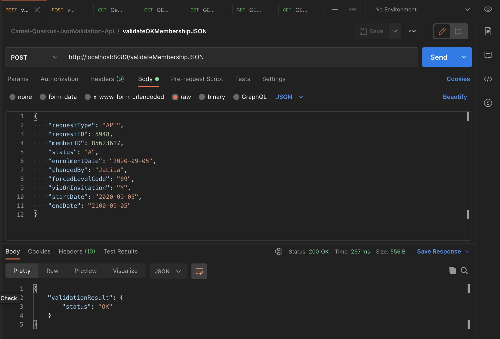

# Camel-Quarkus-JsonValidation-Api project

This project leverages **Red Hat build of Quarkus 1.7.x**, the Supersonic Subatomic Java Framework.

It exposes the following RESTful service endpoints  using the **Apache Camel Quarkus Platform extension**: 
- `/validateMembershipJSON` : validates a sample `Membership` JSON instance through the `POST` HTTP method.
- `/openapi.json`: returns the OpenAPI 3.0 specification for the service.
- `/health` : returns the _Camel Quarkus MicroProfile_ health checks
- `/metrics` : the _Camel Quarkus MicroProfile_ metrics

## Prerequisites
- JDK 11 installed with `JAVA_HOME` configured appropriately
- Apache Maven 3.6.2+

## Running the application in dev mode

You can run your application in dev mode that enables live coding using:
```
./mvnw quarkus:dev
```

## Packaging and running the application locally

The application can be packaged using `./mvnw package`.
It produces the `camel-quarkus-jsonvalidation-api-1.0.0-SNAPSHOT-runner.jar` file in the `/target` directory.
Be aware that it’s not an _über-jar_ as the dependencies are copied into the `target/lib` directory.

The application is now runnable using `java -jar target/camel-quarkus-jsonvalidation-api-1.0.0-SNAPSHOT-runner.jar`.

## Packaging and running the application on Red Hat OpenShift

### Pre-requisites
- Access to a [Red Hat OpenShift](https://access.redhat.com/documentation/en-us/openshift_container_platform) cluster v3 or v4
- User has self-provisioner privilege or has access to a working OpenShift project

1. Login to the OpenShift cluster
    ```zsh
    oc login ...
    ```
2. Create an OpenShift project or use your existing OpenShift project. For instance, to create `camel-quarkus`
    ```zsh
    oc new-project camel-quarkus-jvm --display-name="Apache Camel Quarkus Apps - JVM Mode"
    ```
3. Use either the _**S2I binary workflow**_ or _**S2I source workflow**_ to deploy the `camel-quarkus-jsonvalidation-api` app as described below.

### OpenShift S2I binary workflow 

This leverages the _Quarkus OpenShift_ extension and is only recommended for development and testing purposes.

```zsh
./mvnw clean package -Dquarkus.kubernetes.deploy=true
```
```zsh
[...]
[INFO] [io.quarkus.deployment.pkg.steps.JarResultBuildStep] Building thin jar: /Users/jeannyil/Workdata/myGit/Quarkus/upstream-quarkus-camel-demos/camel-quarkus-jsonvalidation-api/target/camel-quarkus-jsonvalidation-api-1.0.0-SNAPSHOT-runner.jar
[INFO] [io.quarkus.kubernetes.deployment.KubernetesDeploy] Kubernetes API Server at 'https://api.cluster-ce1b.sandbox753.opentlc.com:6443/' successfully contacted.
[...]
[INFO] [io.quarkus.container.image.s2i.deployment.S2iProcessor] Performing s2i binary build with jar on server: https://api.cluster-ce1b.sandbox753.opentlc.com:6443/ in namespace:camel-quarkus.
[...]
[INFO] [io.quarkus.container.image.s2i.deployment.S2iProcessor] Successfully pushed image-registry.openshift-image-registry.svc:5000/camel-quarkus/camel-quarkus-jsonvalidation-api@sha256:5cc56e5b72d56a637a163f8972ca27f90296bc265dd1d30c1c72e14a62f2ad93
[INFO] [io.quarkus.container.image.s2i.deployment.S2iProcessor] Successfully pushed image-registry.openshift-image-registry.svc:5000/camel-quarkus/camel-quarkus-jsonvalidation-api@sha256:bd6a27e22810ce84c38ddee840d4f07d84f25a710953e602cd363947a60733e4
[INFO] [io.quarkus.container.image.s2i.deployment.S2iProcessor] Push successful
[INFO] [io.quarkus.kubernetes.deployment.KubernetesDeployer] Deploying to openshift server: https://api.cluster-ce1b.sandbox753.opentlc.com:6443/ in namespace: camel-quarkus.
[...]
```

### OpenShift S2I source workflow (recommended for PRODUCTION use)

1. Make sure the latest supported OpenJDK 11 image is imported in OpenShift
    ```zsh
    oc import-image --confirm openjdk-11-ubi8 \
    --from=registry.access.redhat.com/ubi8/openjdk-11 \
    -n openshift
    ```
2. Create the `camel-quarkus-jsonvalidation-api` OpenShift application from the git repository
    ```zsh
    oc new-app https://github.com/jeanNyil/upstream-quarkus-camel-demos.git \
    --context-dir=camel-quarkus-jsonvalidation-api \
    --name=camel-quarkus-jsonvalidation-api \
    --image-stream="openshift/openjdk-11-ubi8"
    ```
3. Follow the log of the S2I build
    ```zsh
    oc logs bc/camel-quarkus-jsonvalidation-api -f
    ```
    ```zsh
    Cloning "https://github.com/jeanNyil/upstream-quarkus-camel-demos.git" ...
            Commit: 4911116e6cb9ace7304c7f8b77322b60d3b591f0 (Updated README)
            Author: Jean Armand Nyilimbibi <jean.nyilimbibi@gmail.com>
            Date:   Mon Sep 7 20:34:02 2020 +0200
    [...]
    Successfully pushed image-registry.openshift-image-registry.svc:5000/camel-quarkus/camel-quarkus-jsonvalidation-api-s2i@sha256:f4d91fcda670edd3dd1a8dfa4860fbfbb3cf43a590c67addbec9dc240f4672d4
    Push successful
    ```
4. Create a non-secure route to expose the `camel-quarkus-jsonvalidation-api` service outside the OpenShift cluster
    ```zsh
    oc expose svc/camel-quarkus-jsonvalidation-api
    ```

## Testing the application on OpenShift

1. Get the OpenShift route hostname
    ```zsh
    URL="http://$(oc get route camel-quarkus-jsonvalidation-api -o jsonpath='{.spec.host}')"
    ```
2. Test the `/validateMembershipJSON` endpoint
    ```zsh
    curl -w '\n' -X POST -H 'Content-Type: application/json' \
    -d '{"requestType": "API","requestID": 5948,"memberID": 85623617,"status": "A","enrolmentDate": "2020-09-05","changedBy": "JaLiLa","forcedLevelCode": "69","vipOnInvitation": "Y","startDate": "2020-09-05","endDate": "2100-09-05"}' \
    $URL/validateMembershipJSON
    ```
    ```json
    {
        "validationResult" : {
            "status" : "OK"
        }
    }
    ```
3. Test the `/openapi.json` endpoint
    ```zsh
    curl -w '\n' $URL/openapi.json
    ```
    ```json
    {
        "openapi": "3.0.2",
        "info": {
            "title": "Sample JSON Validation API",
            "version": "1.0.0",
            "description": "A simple API to test the Camel json-schema-validator component",
            "contact": {
                "name": "Jean Nyilimbibi"
            },
            "license": {
                "name": "MIT License",
                "url": "https://opensource.org/licenses/MIT"
            }
        },
        "servers": [
            {
                "url": "http://camel-quarkus-json-validation-api.apps.cluster-ce1b.sandbox753.opentlc.com",
                "description": "API Backend URL"
            }
        ],
        "paths": {
            "/validateMembershipJSON": {
                "post": {
                    "requestBody": {
                        "description": "A `Membership` JSON instance to be validated.",
                        "content": {
                            "application/json": {
                                "schema": {
                                    "$ref": "#/components/schemas/Membership"
                                }
                            }
                        },
                        "required": true
                    },
                    "responses": {
                        "200": {
                            "content": {
                                "application/json": {
                                    "schema": {
                                        "$ref": "#/components/schemas/ValidationResult"
                                    },
                                    "examples": {
                                        "validationResult_200": {
                                            "value": {
                                                "validationResult": {
                                                    "status": "OK"
                                                }
                                            }
                                        }
                                    }
                                }
                            },
                            "description": "`Membership`JSON data validated"
                        },
                        "400": {
                            "content": {
                                "application/json": {
                                    "schema": {
                                        "$ref": "#/components/schemas/ValidationResult"
                                    },
                                    "examples": {
                                        "validationResult_400": {
                                            "value": {
                                                "validationResult": {
                                                    "status": "KO",
                                                    "errorMessage": "JSon validation error with 2 errors. Exchange[ID-sample-json-validation-api-1-nxgnq-1620389968195-0-427]"
                                                }
                                            }
                                        }
                                    }
                                }
                            },
                            "description": "`Membership`JSON data not valid"
                        },
                        "500": {
                            "content": {
                                "application/json": {
                                    "schema": {
                                        "$ref": "#/components/schemas/Error"
                                    },
                                    "examples": {
                                        "error_500": {
                                            "value": {
                                                "error": {
                                                    "id": "500",
                                                    "description": "Internal Server Error",
                                                    "messages": [
                                                        "java.lang.Exception: Mocked error message"
                                                    ]
                                                }
                                            }
                                        }
                                    }
                                }
                            },
                            "description": "Internal server error"
                        }
                    },
                    "operationId": "validateMembershipJSON",
                    "summary": "Validate Membership JSON instance",
                    "description": "Validates a `Membership` JSON instance",
                    "x-codegen-request-body-name": "body"
                }
            }
        },
        "components": {
            "schemas": {
                "Membership": {
                    "description": "Membership data ",
                    "required": [
                        "changedBy",
                        "endDate",
                        "enrolmentDate",
                        "memberID",
                        "requestID",
                        "requestType",
                        "vipOnInvitation"
                    ],
                    "type": "object",
                    "properties": {
                        "requestType": {
                            "type": "string"
                        },
                        "requestID": {
                            "format": "int32",
                            "type": "integer"
                        },
                        "memberID": {
                            "format": "int32",
                            "type": "integer"
                        },
                        "status": {
                            "maxLength": 1,
                            "minLength": 1,
                            "enum": [
                                "A",
                                "B",
                                "C"
                            ],
                            "type": "string"
                        },
                        "enrolmentDate": {
                            "format": "date",
                            "type": "string"
                        },
                        "changedBy": {
                            "type": "string"
                        },
                        "forcedLevelCode": {
                            "type": "string"
                        },
                        "vipOnInvitation": {
                            "maxLength": 1,
                            "minLength": 1,
                            "enum": [
                                "N",
                                "Y"
                            ],
                            "type": "string"
                        },
                        "startDate": {
                            "format": "date",
                            "type": "string"
                        },
                        "endDate": {
                            "format": "date",
                            "type": "string"
                        }
                    },
                    "example": {
                        "requestType": "API",
                        "requestID": 5948,
                        "memberID": 85623617,
                        "status": "A",
                        "enrolmentDate": "2019-06-16",
                        "changedBy": "jeanNyil",
                        "forcedLevelCode": "69",
                        "vipOnInvitation": "Y",
                        "startDate": "2019-06-16",
                        "endDate": "2100-06-16"
                    }
                },
                "ValidationResult": {
                    "description": "Validation Result   ",
                    "type": "object",
                    "properties": {
                        "validationResult": {
                            "type": "object",
                            "properties": {
                                "status": {
                                    "maxLength": 2,
                                    "minLength": 2,
                                    "enum": [
                                        "OK",
                                        "KO"
                                    ],
                                    "type": "string"
                                },
                                "errorMessage": {
                                    "type": "string"
                                }
                            }
                        }
                    },
                    "example": "{\n    \"validationResult\": {\n        \"status\": \"KO\",\n        \"errorMessage\": \"6 errors found\"\n    }\n}"
                },
                "Error": {
                    "description": "Error message structure",
                    "type": "object",
                    "properties": {
                        "error": {
                            "type": "object",
                            "properties": {
                                "id": {
                                    "type": "string"
                                },
                                "description": {
                                    "type": "string"
                                },
                                "messages": {
                                    "type": "array",
                                    "items": {
                                        "type": "object"
                                    }
                                }
                            }
                        }
                    },
                    "example": {
                        "error": {
                            "id": "500",
                            "description": "Internal Server Error",
                            "messages": [
                                "java.lang.Exception: Mocked error message"
                            ]
                        }
                    }
                }
            }
        }
    }
    ```
4. Test the `/health` endpoint
    ```zsh
    curl -w '\n' $URL/health
    ```
    ```json
    {
        "status": "UP",
        "checks": [
            {
                "name": "camel-liveness-checks",
                "status": "UP"
            },
            {
                "name": "camel-readiness-checks",
                "status": "UP"
            },
            {
                "name": "camel-context-check",
                "status": "UP",
                "data": {
                    "contextStatus": "Started",
                    "name": "camel-1"
                }
            }
        ]
    }
    ```
5. Test the `/health/live` endpoint
    ```zsh
    curl -w '\n' $URL/health/live
    ```
    ```json
    {
        "status": "UP",
        "checks": [
            {
                "name": "camel-liveness-checks",
                "status": "UP"
            }
        ]
    }
    ```
6. Test the `/health/ready` endpoint
    ```zsh
    curl -w '\n' $URL/health/ready
    ```
    ```json
    {
        "status": "UP",
        "checks": [
            {
                "name": "camel-readiness-checks",
                "status": "UP"
            },
            {
                "name": "camel-context-check",
                "status": "UP",
                "data": {
                    "contextStatus": "Started",
                    "name": "camel-1"
                }
            }
        ]
    }
    ```
7. Test the `/metrics` endpoint
    ```zsh
    curl -w '\n' $URL/metrics
    ```
    ```zsh
    [...]
    # HELP application_camel_context_exchanges_total The total number of exchanges for a route or Camel Context
    # TYPE application_camel_context_exchanges_total counter
    application_camel_context_exchanges_total{camelContext="camel-1"} 20.0
    [...]
    # HELP application_camel_route_exchanges_total The total number of exchanges for a route or Camel Context
    # TYPE application_camel_route_exchanges_total counter
    application_camel_route_exchanges_total{camelContext="camel-1",routeId="common-500-http-code-route"} 0.0
    application_camel_route_exchanges_total{camelContext="camel-1",routeId="custom-http-error-route"} 0.0
    application_camel_route_exchanges_total{camelContext="camel-1",routeId="get-openapi-spec-route"} 2.0
    application_camel_route_exchanges_total{camelContext="camel-1",routeId="json-validation-api-route"} 20.0
    application_camel_route_exchanges_total{camelContext="camel-1",routeId="validate-membership-json-route"} 20.0
    [...]
    ```

## Testing using [Postman](https://www.postman.com/)

Import the provided Postman Collection for testing: [tests/Camel-Quarkus-JsonValidation-Api.postman_collection.json](./tests/Camel-Quarkus-JsonValidation-Api.postman_collection.json) 


## Creating a native executable

### Running locally

You can create a native executable using: `./mvnw package -Pnative`.

Or, if you don't have GraalVM installed, you can run the native executable build in a container using: `./mvnw package -Pnative -Dquarkus.native.container-build=true`.

You can then execute your native executable with: `./target/camel-quarkus-jsonvalidation-api-1.0.0-SNAPSHOT-runner`

If you want to learn more about building native executables, please consult https://quarkus.io/guides/building-native-image.

### Deploying the native executable as an _OpenShift Serverless_ service

#### Prerequisites

- Access to a [Red Hat OpenShift](https://access.redhat.com/documentation/en-us/openshift_container_platform) 4 cluster
    - _[OpenShift Serverless](https://access.redhat.com/documentation/en-us/openshift_container_platform/4.6/html/serverless_applications/installing-openshift-serverless-1#installing-openshift-serverless)_ operator is installed
    - _[OpenShift Knative Serving](https://access.redhat.com/documentation/en-us/openshift_container_platform/4.6/html/serverless_applications/installing-openshift-serverless-1#installing-knative-serving)_ is installed
- _[Podman](https://podman.io/)_ or _[Docker](https://www.docker.com/)_ container-runtime environment for native compilation
- The _[kn](https://access.redhat.com/documentation/en-us/openshift_container_platform/4.6/html/serverless_applications/installing-openshift-serverless-1#installing-kn)_ CLI tool is installed
- User has self-provisioner privilege or has access to a working OpenShift project

#### Instructions

1. Login to the OpenShift cluster
    ```zsh
    oc login ...
    ```

2. Create an OpenShift project or use your existing OpenShift project. For instance, to create `camel-quarkus-native`
    ```zsh
    oc new-project camel-quarkus-native --display-name="Apache Camel Quarkus Apps - Native Mode"
    ```

3. Build a Linux executable using a container build. Compiling a Quarkus application to a native executable consumes a lot of memory during analysis and optimization. You can limit the amount of memory used during native compilation by setting the `quarkus.native.native-image-xmx` configuration property. Setting low memory limits might increase the build time.
    1. For Docker use:
        ```zsh
        ./mvnw package -Pnative -Dquarkus.native.container-build=true \
        -Dquarkus.native.builder-image=registry.access.redhat.com/quarkus/mandrel-20-rhel8:20.1 \
        -Dquarkus.native.native-image-xmx=6g
        ```
    2. For Podman use:
        ```zsh
        ./mvnw package -Pnative -Dquarkus.native.container-build=true \
        -Dquarkus.native.container-runtime=podman \
        -Dquarkus.native.builder-image=registry.access.redhat.com/quarkus/mandrel-20-rhel8:20.1 \
        -Dquarkus.native.native-image-xmx=6g
        ```
    ```zsh
    [...]
    [INFO] [io.quarkus.deployment.pkg.steps.JarResultBuildStep] Building native image source jar: /Users/jnyilimb/workdata/myGit/Quarkus/rh-build-quarkus-camel-demos/camel-quarkus-jsonvalidation-api/target/camel-quarkus-jsonvalidation-api-1.0.0-SNAPSHOT-native-image-source-jar/camel-quarkus-jsonvalidation-api-1.0.0-SNAPSHOT-runner.jar
    [INFO] [io.quarkus.deployment.pkg.steps.NativeImageBuildStep] Building native image from /Users/jnyilimb/workdata/myGit/Quarkus/rh-build-quarkus-camel-demos/camel-quarkus-jsonvalidation-api/target/camel-quarkus-jsonvalidation-api-1.0.0-SNAPSHOT-native-image-source-jar/camel-quarkus-jsonvalidation-api-1.0.0-SNAPSHOT-runner.jar
    [INFO] [io.quarkus.deployment.pkg.steps.NativeImageBuildStep] Checking image status registry.access.redhat.com/quarkus/mandrel-20-rhel8:20.1
    20.1: Pulling from quarkus/mandrel-20-rhel8
    Digest: sha256:f4914b8717883835a28f61b5bf25421671adc968474da7042c9ca93ab63251a2
    Status: Image is up to date for registry.access.redhat.com/quarkus/mandrel-20-rhel8:20.1
    registry.access.redhat.com/quarkus/mandrel-20-rhel8:20.1
    [INFO] [io.quarkus.deployment.pkg.steps.NativeImageBuildStep] Running Quarkus native-image plugin on GraalVM Version 20.1.0.3_0-1 (Mandrel Distribution) (Java Version 11.0.9+11-LTS)
    [INFO] [io.quarkus.deployment.pkg.steps.NativeImageBuildStep] docker run -v /Users/jnyilimb/workdata/myGit/Quarkus/rh-build-quarkus-camel-demos/camel-quarkus-jsonvalidation-api/target/camel-quarkus-jsonvalidation-api-1.0.0-SNAPSHOT-native-image-source-jar:/project:z --env LANG=C --rm registry.access.redhat.com/quarkus/mandrel-20-rhel8:20.1 -J-Dsun.nio.ch.maxUpdateArraySize=100 -J-Djava.util.logging.manager=org.jboss.logmanager.LogManager -J-Dvertx.logger-delegate-factory-class-name=io.quarkus.vertx.core.runtime.VertxLogDelegateFactory -J-Dvertx.disableDnsResolver=true -J-Dio.netty.leakDetection.level=DISABLED -J-Dio.netty.allocator.maxOrder=1 -J-Dcom.sun.xml.bind.v2.bytecode.ClassTailor.noOptimize=true -J-Duser.language=en -J-Dfile.encoding=UTF-8 --initialize-at-build-time= -H:InitialCollectionPolicy=com.oracle.svm.core.genscavenge.CollectionPolicy\$BySpaceAndTime -H:+JNI -jar camel-quarkus-jsonvalidation-api-1.0.0-SNAPSHOT-runner.jar -H:FallbackThreshold=0 -H:+ReportExceptionStackTraces -J-Xmx6g -H:+AddAllCharsets -H:EnableURLProtocols=http,https --enable-all-security-services -H:-UseServiceLoaderFeature -H:+StackTrace camel-quarkus-jsonvalidation-api-1.0.0-SNAPSHOT-runner
    [...]
    [INFO] [io.quarkus.deployment.QuarkusAugmentor] Quarkus augmentation completed in 811047ms
    [INFO] ------------------------------------------------------------------------
    [INFO] BUILD SUCCESS
    [INFO] ------------------------------------------------------------------------
    [INFO] Total time:  13:37 min
    [INFO] Finished at: 2020-11-03T20:21:08+01:00
    [INFO] ------------------------------------------------------------------------
    ```

4. Create the `camel-quarkus-jsonvalidation-api` container image using the _OpenShift Docker build_ strategy. This strategy creates a container using a build configuration in the cluster.
    1. Create a build config based on the [`src/main/docker/Dockerfile.native`](./src/main/docker/Dockerfile.native) file:
        ```zsh
        cat src/main/docker/Dockerfile.native | oc new-build \
        --name camel-quarkus-jsonvalidation-api --strategy=docker --dockerfile -
        ```
    2. Build the project:
        ```zsh
        oc start-build camel-quarkus-jsonvalidation-api --from-dir . -F
        ```
        ```zsh
        Uploading directory "." as binary input for the build ...
        ....
        Uploading finished
        build.build.openshift.io/camel-quarkus-jsonvalidation-api-2 started
        Receiving source from STDIN as archive ...
        Replaced Dockerfile FROM image registry.access.redhat.com/ubi8/ubi-minimal:8.1
        [...]
        Successfully pushed image-registry.openshift-image-registry.svc:5000/camel-quarkus-native/camel-quarkus-jsonvalidation-api@sha256:786f5f22ebbede61de91be7d3d41db9a155fd447cea3e0db414b042305c482dd
        Push successful
        ```

5. Deploy the `camel-quarkus-jsonvalidation-api` as a serverless application
    ```zsh
    kn service create camel-quarkus-jsonvalidation-api \
    --label app.openshift.io/runtime=quarkus \
    --image image-registry.openshift-image-registry.svc:5000/camel-quarkus-native/camel-quarkus-jsonvalidation-api:latest
    ```

6. To verify that the `camel-quarkus-jsonvalidation-api` service is ready, enter the following command.
    ```zsh
    kn service list camel-quarkus-jsonvalidation-api
    ```
    The output in the column called "READY" reads `True` if the service is ready.

## Start-up time comparison on the same OpenShift cluster

### JVM mode

```zsh
[...]
2021-05-07 23:11:22,445 INFO  [org.apa.cam.imp.eng.InternalRouteStartupManager] (main) Route: common-500-http-code-route started and consuming from: direct://common-500
2021-05-07 23:11:22,446 INFO  [org.apa.cam.imp.eng.InternalRouteStartupManager] (main) Route: custom-http-error-route started and consuming from: direct://custom-http-error
2021-05-07 23:11:22,446 INFO  [org.apa.cam.imp.eng.InternalRouteStartupManager] (main) Route: validate-membership-json-route started and consuming from: direct://validateMembershipJSON
2021-05-07 23:11:22,452 INFO  [org.apa.cam.imp.eng.InternalRouteStartupManager] (main) Route: get-openapi-spec-route started and consuming from: platform-http:///openapi.json
2021-05-07 23:11:22,452 INFO  [org.apa.cam.imp.eng.InternalRouteStartupManager] (main) Route: json-validation-api-route started and consuming from: platform-http:///validateMembershipJSON
2021-05-07 23:11:22,453 INFO  [org.apa.cam.imp.eng.AbstractCamelContext] (main) Total 5 routes, of which 5 are started
2021-05-07 23:11:22,453 INFO  [org.apa.cam.imp.eng.AbstractCamelContext] (main) Apache Camel 3.4.2 (camel-1) started in 0.184 seconds
2021-05-07 23:11:22,536 INFO  [io.quarkus] (main) camel-quarkus-jsonvalidation-api 1.0.0-SNAPSHOT on JVM (powered by Quarkus 1.7.5.Final-redhat-00007) started in 1.336s. Listening on: http://0.0.0.0:8080
2021-05-07 23:11:22,537 INFO  [io.quarkus] (main) Profile prod activated.
[...]
```

### Native mode

```zsh
[...]
2021-05-08 00:07:57,301 INFO  [org.apa.cam.imp.eng.InternalRouteStartupManager] (main) Route: common-500-http-code-route started and consuming from: direct://common-500
2021-05-08 00:07:57,301 INFO  [org.apa.cam.imp.eng.InternalRouteStartupManager] (main) Route: custom-http-error-route started and consuming from: direct://custom-http-error
2021-05-08 00:07:57,301 INFO  [org.apa.cam.imp.eng.InternalRouteStartupManager] (main) Route: get-openapi-spec-route started and consuming from: platform-http:///openapi.json
2021-05-08 00:07:57,301 INFO  [org.apa.cam.imp.eng.InternalRouteStartupManager] (main) Route: json-validation-api-route started and consuming from: platform-http:///validateMembershipJSON
2021-05-08 00:07:57,301 INFO  [org.apa.cam.imp.eng.InternalRouteStartupManager] (main) Route: validate-membership-json-route started and consuming from: direct://validateMembershipJSON
2021-05-08 00:07:57,301 INFO  [org.apa.cam.imp.eng.AbstractCamelContext] (main) Total 5 routes, of which 5 are started
2021-05-08 00:07:57,301 INFO  [org.apa.cam.imp.eng.AbstractCamelContext] (main) Apache Camel 3.4.2 (camel-1) started in 0.001 seconds
2021-05-08 00:07:57,320 INFO  [io.quarkus] (main) camel-quarkus-jsonvalidation-api 1.0.0-SNAPSHOT native (powered by Quarkus 1.7.5.Final-redhat-00007) started in 0.083s. Listening on: http://0.0.0.0:8080
2021-05-08 00:07:57,320 INFO  [io.quarkus] (main) Profile prod activated.
[...]
```