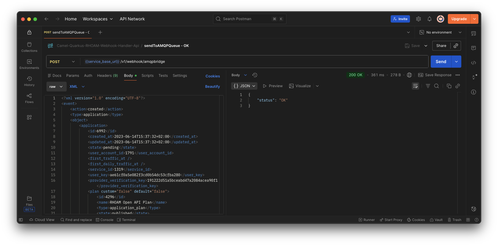

# Camel-Quarkus-RHOAM-Webhook-Handler-Api project

This project leverages [**Red Hat build of Quarkus 3.33.x**](https://docs.redhat.com/en/documentation/red_hat_build_of_quarkus/3.33), the Supersonic Subatomic Java Framework. More specifically, the project is implemented using [**Red Hat build of Apache Camel v4.18.x for Quarkus**](https://docs.redhat.com/en/documentation/red_hat_build_of_apache_camel/4.18#Red%20Hat%20build%20of%20Apache%20Camel%20for%20Quarkus).

It exposes the following RESTful service endpoints using **Apache Camel REST DSL**:
- `/v1/webhook/amqpbridge` : 
    - Webhook ping endpoint through the `GET` HTTP method.
    - Sends RHOAM Admin/Developer Portal webhook XML event to an AMQP address (`RHOAM.WEBHOOK.EVENTS.QUEUE`) through the `POST` HTTP method.
- `/q/openapi` _on a separate management interface (port **9876**)_ : returns the Open API Schema document of the service.
- `/q/swagger-ui` _on a separate management interface (port **9876**)_ :  opens the Open API UI.
- `/observe/health` _on a separate management interface (port **9876**)_ : returns the _Camel Quarkus MicroProfile_ health checks.
- `/observe/metrics` _on a separate management interface (port **9876**)_ : the _Camel Quarkus Micrometer_ metrics in prometheus format.

Moreover, this project leverages the [**Quarkus Kubernetes-Config** extension](https://quarkus.io/guides/kubernetes-config) to customize the run-time AMQP broker connection parameters according to your OpenShift environment. In the **prod** profile, the extension loads the `camel-quarkus-rhoam-webhook-handler-api-config` ConfigMap and `camel-quarkus-rhoam-webhook-handler-api-secret` Secret defined in [`src/main/kubernetes/openshift.yml`](./src/main/kubernetes/openshift.yml). Replace the Secret’s `quarkus.qpid-jms.*` `<CHANGEME_*>` placeholders before deploying. See [Packaging and running the application on Red Hat OpenShift](#packaging-and-running-the-application-on-red-hat-openshift).

## Prerequisites
- JDK 21 installed with `JAVA_HOME` configured appropriately
- Apache Maven 3.9.9
- An [**AMQP 1.0 protocol**](https://www.amqp.org/) compliant broker should be installed and running. [**Red Hat AMQ Broker v7.13.x on OpenShift**](https://docs.redhat.com/en/documentation/red_hat_amq_broker/7.13/html/deploying_amq_broker_on_openshift/index) with a TLS-secured AMQP acceptor has been used for testing.
- **OPTIONAL**: [**Jaeger**](https://www.jaegertracing.io/), a distributed tracing system for observability ([_open tracing_](https://opentracing.io/)). :bulb: A simple way of starting a Jaeger tracing server is with `docker` or `podman`:
    1. Start the Jaeger tracing server:
        ```shell
        podman run --rm -e COLLECTOR_ZIPKIN_HOST_PORT=:9411 -e COLLECTOR_OTLP_ENABLED=true \
        -p 6831:6831/udp -p 6832:6832/udp \
        -p 5778:5778 -p 16686:16686 -p 4317:4317 -p 4318:4318 -p 14250:14250  -p 14268:14268 -p 14269:14269 -p 9411:9411 \
        quay.io/jaegertracing/all-in-one:latest
        ```
    2. While the server is running, browse to http://localhost:16686 to view tracing events.

## Running the application in dev mode

You can run your application in dev mode that enables live coding using:
```shell
./mvnw clean compile quarkus:dev
```

> **_NOTE:_**  Quarkus now ships with a Dev UI, which is available in dev mode only at http://localhost:8080/q/dev-ui.

## Replace anonymized AMQP settings (local packaged / native)

Before running locally with `java -jar` or a native executable, replace the `<CHANGEME_*>` placeholders in [`src/main/resources/application.yml`](./src/main/resources/application.yml) under `quarkus.qpid-jms`:

- `url`: AMQ broker OpenShift **route** hostname and port, keeping the existing query string. E.g.: `amqps://amq-ssl-broker-amqp-0-svc-rte-amq7-broker-cluster.apps.sno.jnyilimb.eu:443?transport.trustAll=true&transport.verifyHost=false&amqp.idleTimeout=120000`
- `username` / `password`: AMQ broker user credentials

> **_NOTE:_**  Skip this step for `./mvnw quarkus:dev`. The `%dev` profile already uses [AMQP Dev Services](https://quarkus.io/guides/amqp-dev-services) (`amqp://localhost:5672`, `admin`/`admin`).

## Packaging and running the application locally

The application can be packaged using:
```shell
./mvnw clean package
```
It produces the `quarkus-run.jar` file in the `target/quarkus-app/` directory.
Be aware that it’s not an _über-jar_ as the dependencies are copied into the `target/quarkus-app/lib/` directory.

The application is now runnable using:
```shell
java -Dquarkus.kubernetes-config.enabled=false -jar target/quarkus-app/quarkus-run.jar
```

If you want to build an _über-jar_, execute the following command:
```shell
./mvnw clean package -Dquarkus.package.type=uber-jar
```

The application, packaged as an _über-jar_, is now runnable using:
```shell
java -Dquarkus.kubernetes-config.enabled=false -jar target/*-runner.jar
```

Replace the anonymized AMQP settings in [`src/main/resources/application.yml`](./src/main/resources/application.yml) first. See [Replace anonymized AMQP settings (local packaged / native)](#replace-anonymized-amqp-settings-local-packaged--native).

As an **alternative** to editing the YAML, you may customize at run time:
- The **AMQP broker connection parameters** by adding the following _system properties_:
    - `quarkus.qpid-jms.url`
    - `quarkus.qpid-jms.username`
    - `quarkus.qpid-jms.password`
- The Jaeger collector endpoint by adding the following _system properties_:
    - `quarkus.otel.exporter.otlp.endpoint`

Example:
```shell
java -Dquarkus.qpid-jms.url="amqps://amq-ssl-broker-amqp-0-svc-rte-amq7-broker-cluster.apps.sno.jnyilimb.eu:443?transport.trustAll=true&transport.verifyHost=false&amqp.idleTimeout=120000" -Dquarkus.otel.exporter.otlp.endpoint="http://localhost:4317" -jar target/quarkus-app/quarkus-run.jar
```

## Packaging and running the application on Red Hat OpenShift

### Pre-requisites
- Access to a [Red Hat OpenShift](https://access.redhat.com/documentation/en-us/openshift_container_platform) cluster
- User has self-provisioner privilege or has access to a working OpenShift project
- An [**AMQP 1.0 protocol**](https://www.amqp.org/) compliant broker should be installed and running. [**Red Hat AMQ Broker v7.13.x on OpenShift**](https://docs.redhat.com/en/documentation/red_hat_amq_broker/7.13/html/deploying_amq_broker_on_openshift/index) with a TLS-secured AMQP acceptor has been used for testing.

1. Login to the OpenShift cluster
    ```shell
    oc login ...
    ```

2. Create an OpenShift project or use your existing OpenShift project. For instance, to create `ceq-services-jvm`
    ```shell
    oc new-project ceq-services-jvm --display-name="Red Hat build of Apache Camel for Quarkus Apps - JVM Mode"
    ```
        
3. Create an `allInOne` Jaeger instance.
    1. **IF NOT ALREADY INSTALLED**:
        1. Install, via OLM, the `Red Hat OpenShift distributed tracing platform` (Jaeger) operator with an `AllNamespaces` scope. :warning: Needs `cluster-admin` privileges
            ```shell
            oc apply -f - <<EOF
            apiVersion: operators.coreos.com/v1alpha1
            kind: Subscription
            metadata:
                name: jaeger-product
                namespace: openshift-operators
            spec:
                channel: stable
                installPlanApproval: Automatic
                name: jaeger-product
                source: redhat-operators
                sourceNamespace: openshift-marketplace
            EOF
            ```
        2. Verify the successful installation of the `Red Hat OpenShift distributed tracing platform` operator
            ```shell
            watch oc get sub,csv
            ```
    2. Create the `allInOne` Jaeger instance.
        ```shell
        oc apply -f - <<EOF
        apiVersion: jaegertracing.io/v1
        kind: Jaeger
        metadata:
            name: jaeger-all-in-one-inmemory
        spec:
            allInOne:
                options:
                log-level: info
            strategy: allInOne
        EOF
        ```

4. Replace anonymized AMQP settings in [`src/main/kubernetes/openshift.yml`](./src/main/kubernetes/openshift.yml)

    In the **prod** profile, the [Quarkus Kubernetes Config](https://quarkus.io/guides/kubernetes-config) extension loads the `camel-quarkus-rhoam-webhook-handler-api-config` ConfigMap and `camel-quarkus-rhoam-webhook-handler-api-secret` Secret defined in that file. The Secret overrides AMQP broker settings at runtime.

    Replace the `<CHANGEME_*>` keys in the Secret `stringData` **before** deploying so the generated Secret is correct on first apply:

    - `quarkus.qpid-jms.url`: in-cluster AMQP service hostname and port, keeping the existing query string. E.g.: `amqps://amq-ssl-broker-amqp-0-svc.amq7-broker-cluster.svc:5672?transport.trustAll=true&transport.verifyHost=false&amqp.idleTimeout=120000`
    - `quarkus.qpid-jms.username` / `quarkus.qpid-jms.password`: AMQ broker user credentials

    > **_NOTE:_**  Adjust `quarkus.otel.exporter.otlp.endpoint` in the ConfigMap if your collector is not `otel-collector.observability.svc:4317`.

5. Deploy to OpenShift using the _**S2I binary workflow**_
    ```shell
    ./mvnw clean package -Dquarkus.openshift.deploy=true
    ```

## Testing the application on OpenShift

### Pre-requisites

- [**`curl`**](https://curl.se/) or [**`HTTPie`**](https://httpie.io/) command line tools. 
- [**`HTTPie`**](https://httpie.io/) has been used in the tests.

### Testing instructions:

1. Get the OpenShift route hostname
    ```shell
    URL="https://$(oc get route camel-quarkus-rhoam-webhook-handler-api -o jsonpath='{.spec.host}')"
    ```
    
2. Test the `/v1/webhook/amqpbridge` endpoint

    - `GET /v1/webhook/amqpbridge` :

        ```shell
        http -v $URL/v1/webhook/amqpbridge
        ```
        ```shell
        [...]
        {
            "status": "OK"
        }
        ```

    - `POST /v1/webhook/amqpbridge` :

        - `OK` response:

            ```shell
            echo '<?xml version="1.0" encoding="UTF-8"?>
            <event>
            <action>updated</action>
            <type>account</type>
            <object>
                <account>
                <id>6</id>
                <created_at>2021-05-14T20:22:53Z</created_at>
                <updated_at>2021-05-14T20:22:53Z</updated_at>
                <state>approved</state>
                <org_name>TestAccount</org_name>
                <extra_fields/>
                <monthly_billing_enabled>true</monthly_billing_enabled>
                <monthly_charging_enabled>true</monthly_charging_enabled>
                <credit_card_stored>false</credit_card_stored>
                <plans>
                    <plan default="true">
                    <id>6</id>
                    <name>Default</name>
                    <type>account_plan</type>
                    <state>hidden</state>
                    <approval_required>false</approval_required>
                    <setup_fee>0.0</setup_fee>
                    <cost_per_month>0.0</cost_per_month>
                    <trial_period_days/>
                    <cancellation_period>0</cancellation_period>
                    </plan>
                </plans>
                <users>
                    <user>
                    <id>9</id>
                    <created_at>2021-05-14T20:22:53Z</created_at>
                    <updated_at>2021-05-14T20:22:53Z</updated_at>
                    <account_id>6</account_id>
                    <state>pending</state>
                    <role>admin</role>
                    <username>admin</username>
                    <email>admin@acme.org</email>
                    <extra_fields/>
                    </user>
                </users>
                </account>
            </object>
            </event>' | http -v POST $URL/v1/webhook/amqpbridge content-type:application/xml
            ```
            ```shell
            [...]
            HTTP/1.1 200 OK
            breadcrumbid: 28C0FAE9139DB19-0000000000000002
            content-type: application/json
            rhoam_event_action: updated
            rhoam_event_type: account
            set-cookie: 78f292b385e73b7110f972d6e3122473=0a617d702b0000d596f0e3ca813821d5; path=/; HttpOnly; Secure; SameSite=None
            traceparent: 00-1bb463bb3c61e6fe03f6c9896f989ec0-2e66f8ed07b76389-01
            transfer-encoding: chunked

            {
                "status": "OK"
            }
            ```

        - `KO` response:

            ```shell
            echo 'PLAIN TEXT' | http -v POST $URL/v1/webhook/amqpbridge content-type:application/xml
            ```
            ```shell
            [...]
            HTTP/1.1 400 Bad Request
            breadcrumbid: 28C0FAE9139DB19-0000000000000004
            content-type: application/json
            set-cookie: 78f292b385e73b7110f972d6e3122473=0a617d702b0000d596f0e3ca813821d5; path=/; HttpOnly; Secure; SameSite=None
            traceparent: 00-ab4d7bf57041a49b76ecd4aa1c929c79-a37c26b52315ddf2-01
            transfer-encoding: chunked

            {
                "error": {
                    "code": "400",
                    "description": "Bad Request",
                    "message": "org.apache.camel.TypeConversionException: Error during type conversion from type: org.apache.camel.converter.stream.ByteArrayInputStreamCache to the required type: org.w3c.dom.Document with value org.apache.camel.converter.stream.ByteArrayInputStreamCache@63f0fcf6 due to org.xml.sax.SAXParseException: Content is not allowed in prolog."
                },
                "status": "KO"
            }
            ```

## Testing using [Postman](https://www.postman.com/)

Import the provided Postman Collection for testing: [tests/Camel-Quarkus-RHOAM-Webhook-Handler-Api.postman_collection.json](./tests/Camel-Quarkus-RHOAM-Webhook-Handler-Api.postman_collection.json)
 


## Creating a native executable

You can create a native executable using the following command:

```shell
./mvnw clean package -Pnative -Dquarkus.native.native-image-xmx=7g
```

>**NOTE** : The project is configured to use a container runtime for native builds. See `quarkus.native.container-build=true` in the [`application.yml`](./src/main/resources/application.yml). Also, adjust the `quarkus.native.native-image-xmx` value according to your container runtime available memory resources.

You can then execute your native executable with: `./target/camel-quarkus-rhoam-webhook-handler-api-1.0.0-runner`

If you want to learn more about building native executables, please consult https://quarkus.io/guides/building-native-image.

>**NOTE** : If your are on Apple Silicon and built the native image inside a Linux container (-Dquarkus.native.container-build=true), the result is a Linux ELF binary. macOS can’t execute Linux binaries, so launching it on macOS yields “exec format error”. Follow the steps below to run your Linux native binary.

1. Build the container image of your Linux native binary:
    ```shell
    podman build -f src/main/docker/Dockerfile.native -t camel-quarkus-rhoam-webhook-handler-api .
    ```
2. Run the container:
    ```shell
    podman run --rm --name camel-quarkus-rhoam-webhook-handler-api \
    -p 8080:8080,9876:9876 \
    -e QUARKUS_KUBERNETES-CONFIG_ENABLED=false \
    -e QUARKUS_OTEL_EXPORTER_OTLP_ENDPOINT=http://host.containers.internal:4317 \
    camel-quarkus-rhoam-webhook-handler-api 
    ```

## Start-up time comparison in the same environment

Used environment:
- **Laptop**: MacBook PRO
- **CPU**: Apple M2 PRO
- **RAM**: 32Gb
- **Container runtime for native builds**: podman v5.8.2

### JVM mode -> _started in **2.213s**_

```shell
# java -Dquarkus.kubernetes-config.enabled=false -jar target/quarkus-app/quarkus-run.jar
[...]
2026-08-24 18:35:26,401 INFO  traceId=, parentId=, spanId=, sampled= [or.ap.ca.im.en.AbstractCamelContext] (main) Apache Camel 4.18.3.redhat-00001 (camel-quarkus-rhoam-webhook-handler-api) is starting
2026-08-24 18:35:26,473 INFO  traceId=, parentId=, spanId=, sampled= [or.ap.ca.op.OpenTelemetryTracer] (main) Opentelemetry2 enabled
2026-08-24 18:35:26,543 INFO  traceId=, parentId=, spanId=, sampled= [or.ap.ca.im.en.AbstractCamelContext] (main) Routes startup (total:4 rest-dsl:1)
2026-08-24 18:35:26,543 INFO  traceId=, parentId=, spanId=, sampled= [or.ap.ca.im.en.AbstractCamelContext] (main)     Started generate-error-response-route (direct://generateErrorResponse)
2026-08-24 18:35:26,544 INFO  traceId=, parentId=, spanId=, sampled= [or.ap.ca.im.en.AbstractCamelContext] (main)     Started send-to-amqp-queue-route (direct://sendToAMQPQueue)
2026-08-24 18:35:26,544 INFO  traceId=, parentId=, spanId=, sampled= [or.ap.ca.im.en.AbstractCamelContext] (main)     Started ping-webhook-route (direct://pingWebhook)
2026-08-24 18:35:26,544 INFO  traceId=, parentId=, spanId=, sampled= [or.ap.ca.im.en.AbstractCamelContext] (main)     Started route1 (rest-openapi://classpath:META-INF/openapi.yaml)
2026-08-24 18:35:26,545 INFO  traceId=, parentId=, spanId=, sampled= [or.ap.ca.im.en.AbstractCamelContext] (main) Apache Camel 4.18.3.redhat-00001 (camel-quarkus-rhoam-webhook-handler-api) started in 143ms (build:0ms init:0ms start:143ms boot:1s473ms)
2026-08-24 18:35:26,594 INFO  traceId=, parentId=, spanId=, sampled= [io.quarkus] (main) camel-quarkus-rhoam-webhook-handler-api 1.0.0 on JVM (powered by Quarkus 3.33.3.redhat-00002) started in 2.213s. Listening on: http://0.0.0.0:8080. Management interface listening on http://0.0.0.0:9876.
2026-08-24 18:35:26,595 INFO  traceId=, parentId=, spanId=, sampled= [io.quarkus] (main) Profile prod activated. 
2026-08-24 18:35:26,595 INFO  traceId=, parentId=, spanId=, sampled= [io.quarkus] (main) Installed features: [camel-amqp, camel-attachments, camel-bean, camel-core, camel-direct, camel-jackson, camel-jms, camel-jolokia, camel-log, camel-management, camel-micrometer, camel-microprofile-health, camel-observability-services, camel-opentelemetry2, camel-platform-http, camel-rest, camel-rest-openapi, camel-xml-io-dsl, camel-xpath, cdi, config-yaml, kubernetes, kubernetes-client, messaginghub-pooled-jms, micrometer, opentelemetry, qpid-jms, rest, smallrye-context-propagation, smallrye-health, smallrye-openapi, swagger-ui, vertx]
```

### Native mode -> _started in **0.128s**_

```shell
# podman run --rm --name camel-quarkus-rhoam-webhook-handler-api -p 8080:8080,9876:9876 -e QUARKUS_KUBERNETES-CONFIG_ENABLED=false -e QUARKUS_OTEL_EXPORTER_OTLP_ENDPOINT=http://host.containers.internal:4317 camel-quarkus-rhoam-webhook-handler-api
[...]
2026-08-24 16:45:38,919 INFO  traceId=, parentId=, spanId=, sampled= [or.ap.ca.im.en.AbstractCamelContext] (main) Apache Camel 4.18.3.redhat-00001 (camel-quarkus-rhoam-webhook-handler-api) is starting
2026-08-24 16:45:38,937 INFO  traceId=, parentId=, spanId=, sampled= [or.ap.ca.op.OpenTelemetryTracer] (main) Opentelemetry2 enabled
2026-08-24 16:45:38,991 INFO  traceId=, parentId=, spanId=, sampled= [or.ap.ca.im.en.AbstractCamelContext] (main) Routes startup (total:4 rest-dsl:1)
2026-08-24 16:45:38,991 INFO  traceId=, parentId=, spanId=, sampled= [or.ap.ca.im.en.AbstractCamelContext] (main)     Started generate-error-response-route (direct://generateErrorResponse)
2026-08-24 16:45:38,991 INFO  traceId=, parentId=, spanId=, sampled= [or.ap.ca.im.en.AbstractCamelContext] (main)     Started send-to-amqp-queue-route (direct://sendToAMQPQueue)
2026-08-24 16:45:38,991 INFO  traceId=, parentId=, spanId=, sampled= [or.ap.ca.im.en.AbstractCamelContext] (main)     Started ping-webhook-route (direct://pingWebhook)
2026-08-24 16:45:38,991 INFO  traceId=, parentId=, spanId=, sampled= [or.ap.ca.im.en.AbstractCamelContext] (main)     Started route1 (rest-openapi://classpath:META-INF/openapi.yaml)
2026-08-24 16:45:38,991 INFO  traceId=, parentId=, spanId=, sampled= [or.ap.ca.im.en.AbstractCamelContext] (main) Apache Camel 4.18.3.redhat-00001 (camel-quarkus-rhoam-webhook-handler-api) started in 71ms (build:0ms init:0ms start:71ms)
2026-08-24 16:45:38,992 INFO  traceId=, parentId=, spanId=, sampled= [io.quarkus] (main) camel-quarkus-rhoam-webhook-handler-api 1.0.0 native (powered by Quarkus 3.33.3.redhat-00002) started in 0.128s. Listening on: http://0.0.0.0:8080. Management interface listening on http://0.0.0.0:9876.
2026-08-24 16:45:38,992 INFO  traceId=, parentId=, spanId=, sampled= [io.quarkus] (main) Profile prod activated. 
2026-08-24 16:45:38,992 INFO  traceId=, parentId=, spanId=, sampled= [io.quarkus] (main) Installed features: [camel-amqp, camel-attachments, camel-bean, camel-core, camel-direct, camel-jackson, camel-jms, camel-jolokia, camel-log, camel-management, camel-micrometer, camel-microprofile-health, camel-observability-services, camel-opentelemetry2, camel-platform-http, camel-rest, camel-rest-openapi, camel-xml-io-dsl, camel-xpath, cdi, config-yaml, kubernetes, kubernetes-client, messaginghub-pooled-jms, micrometer, opentelemetry, qpid-jms, rest, smallrye-context-propagation, smallrye-health, smallrye-openapi, swagger-ui, vertx]
```