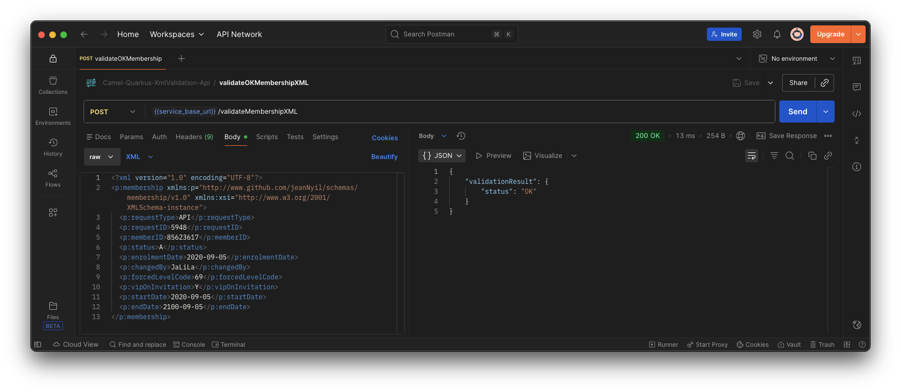

# Camel-Quarkus-XmlValidation-Api project

This project leverages [**Red Hat build of Quarkus 3.27.x**](https://docs.redhat.com/en/documentation/red_hat_build_of_quarkus/3.27), the Supersonic Subatomic Java Framework. More specifically, the project is implemented using [**Red Hat build of Apache Camel v4.14.x for Quarkus**](https://docs.redhat.com/en/documentation/red_hat_build_of_apache_camel/4.14#Red%20Hat%20build%20of%20Apache%20Camel%20for%20Quarkus).

It exposes the following RESTful service endpoints  using **Apache Camel REST DSL**:
- `/validateMembershipXML` : validates a sample `Membership` XML instance through the `POST` HTTP method.
- `/q/openapi` _on a separate management interface (port **9876**)_ : returns the Open API Schema document of the service.
- `/q/swagger-ui` _on a separate management interface (port **9876**)_ :  opens the Open API UI.
- `/observe/health` _on a separate management interface (port **9876**)_ : returns the _Camel Quarkus MicroProfile_ health checks.
- `/observe/metrics` _on a separate management interface (port **9876**)_ : the _Camel Quarkus Micrometer_ metrics in prometheus format.

## Prerequisites
- JDK 21 installed with `JAVA_HOME` configured appropriately
- Apache Maven 3.9.9
- **OPTIONAL**: [**Jaeger**](https://www.jaegertracing.io/), a distributed tracing system for observability ([_open tracing_](https://opentracing.io/)).  :bulb: A simple way of starting a Jaeger tracing server is with `docker` or `podman`:
    1. Start the Jaeger tracing server:
        ```
        podman run --rm -e COLLECTOR_ZIPKIN_HOST_PORT=:9411 -e COLLECTOR_OTLP_ENABLED=true \
        -p 6831:6831/udp -p 6832:6832/udp \
        -p 5778:5778 -p 16686:16686 -p 4317:4317 -p 4318:4318 -p 14250:14250  -p 14268:14268 -p 14269:14269 -p 9411:9411 \
        quay.io/jaegertracing/all-in-one:latest
        ```
    2. While the server is running, browse to http://localhost:16686 to view tracing events.

## Running the application in dev mode

You can run your application in dev mode that enables live coding using:
```
./mvnw clean compile quarkus:dev
```

## Packaging and running the application locally

The application can be packaged using:
```shell
./mvnw clean package
```
It produces the `quarkus-run.jar` file in the `target/quarkus-app/` directory.
Be aware that it’s not an _über-jar_ as the dependencies are copied into the `target/quarkus-app/lib/` directory.

The application is now runnable using:
```shell
java -Dquarkus.kubernetes-config.enabled=false -jar target/quarkus-app/quarkus-run.jar
```

If you want to build an _über-jar_, execute the following command:
```shell
./mvnw clean package -Dquarkus.package.type=uber-jar
```

The application, packaged as an _über-jar_, is now runnable using:
```shell
java -Dquarkus.kubernetes-config.enabled=false -jar target/camel-quarkus-xmlvalidation-api-1.0.0-runner.jar
```

According to your environment, you may want to customize the Jaeger collector endpoint by adding the following run-time _system properties_:
- `quarkus.otel.exporter.otlp.endpoint`

Example:
```
java -Dquarkus.kubernetes-config.enabled=false -Dquarkus.otel.exporter.otlp.endpoint="http://localhost:4317" -jar target/quarkus-app/quarkus-run.jar
```

## Packaging and running the application on Red Hat OpenShift

### Pre-requisites
- Access to a [Red Hat OpenShift](https://access.redhat.com/documentation/en-us/openshift_container_platform) cluster
- User has self-provisioner privilege or has access to a working OpenShift project

1. Login to the OpenShift cluster
    ```shell
    oc login ...
    ```
2. Create an OpenShift project or use your existing OpenShift project. For instance, to create `ceq-services-jvm`
    ```shell
    oc new-project ceq-services-jvm --display-name="Red Hat build of Apache Camel for Quarkus Apps - JVM Mode"
    ```
3. Create an `allInOne` Jaeger instance.
    1. **IF NOT ALREADY INSTALLED**:
        1. Install, via OLM, the `Red Hat OpenShift distributed tracing platform` (Jaeger) operator with an `AllNamespaces` scope. :warning: Needs `cluster-admin` privileges
            ```shell
            oc create --save-config -f - <<EOF
            apiVersion: operators.coreos.com/v1alpha1
            kind: Subscription
            metadata:
                name: jaeger-product
                namespace: openshift-operators
            spec:
                channel: stable
                installPlanApproval: Automatic
                name: jaeger-product
                source: redhat-operators
                sourceNamespace: openshift-marketplace
            EOF
            ```
        2. Verify the successful installation of the `Red Hat OpenShift distributed tracing platform` operator
            ```shell
            watch oc get sub,csv
            ```
    2. Create the `allInOne` Jaeger instance.
        ```shell
        oc create --save-config -f - <<EOF
        apiVersion: jaegertracing.io/v1
        kind: Jaeger
        metadata:
            name: jaeger-all-in-one-inmemory
        spec:
            allInOne:
                options:
                log-level: info
            strategy: allInOne
        EOF
        ```

4. Deploy to OpenShift using the _**S2I binary workflow**_
    ```shell
    ./mvnw clean package -Dquarkus.openshift.deploy=true
    ```

## Testing the application on OpenShift

1. Get the OpenShift route hostname
    ```shell
    URL="https://$(oc get route camel-quarkus-xmlvalidation-api -o jsonpath='{.spec.host}')"
    ```
2. Test the `/validateMembershipJSON` endpoint
    ```shell
    curl -w '\n' -X POST -H 'Content-Type: text/xml' \
    -d '<?xml version="1.0" encoding="UTF-8"?><p:membership xmlns:p="http://www.github.com/jeanNyil/schemas/membership/v1.0" xmlns:xsi="http://www.w3.org/2001/XMLSchema-instance"><p:requestType>API</p:requestType><p:requestID>5948</p:requestID><p:memberID>85623617</p:memberID><p:status>A</p:status><p:enrolmentDate>2020-09-05</p:enrolmentDate><p:changedBy>JaLiLa</p:changedBy><p:forcedLevelCode>69</p:forcedLevelCode><p:vipOnInvitation>Y</p:vipOnInvitation><p:startDate>2020-09-05</p:startDate><p:endDate>2100-09-05</p:endDate></p:membership>' \
    $URL/validateMembershipXML
    ```
    ```json
    {
        "validationResult" : {
            "status" : "OK"
        }
    }
    ```

## Testing using [Postman](https://www.postman.com/)

Import the provided Postman Collection for testing: [tests/Camel-Quarkus-XmlValidation-Api.postman_collection.json](./tests/Camel-Quarkus-XmlValidation-Api.postman_collection.json)
 


## Creating a native executable

You can create a native executable using the following command:

```shell
./mvnw clean package -Pnative -Dquarkus.native.native-image-xmx=7g
```

>**NOTE** : The project is configured to use a container runtime for native builds. See `quarkus.native.container-build=true` in the [`application.yml`](./src/main/resources/application.yml). Also, adjust the `quarkus.native.native-image-xmx` value according to your container runtime available memory resources.

You can then execute your native executable with: `./target/camel-quarkus-xmlvalidation-api-1.0.0-runner`

If you want to learn more about building native executables, please consult https://quarkus.io/guides/building-native-image.

>**NOTE** : If your are on Apple Silicon and built the native image inside a Linux container (-Dquarkus.native.container-build=true), the result is a Linux ELF binary. macOS can’t execute Linux binaries, so launching it on macOS yields “exec format error”. Follow the steps below to run your Linux native binary.

1. Build the container image of your Linux native binary:
    ```shell
    podman build -f src/main/docker/Dockerfile.native -t camel-quarkus-xmlvalidation-api .
    ```
2. Run the container:
    ```shell
    podman run --rm --name camel-quarkus-xmlvalidation-api \
    -p 8080:8080,9876:9876 \
    -e QUARKUS_KUBERNETES-CONFIG_ENABLED=false \
    -e QUARKUS_OTEL_EXPORTER_OTLP_ENDPOINT=http://host.containers.internal:4317 \
    camel-quarkus-xmlvalidation-api 
    ```

## Start-up time comparison in the same environment

Used environment:
- **Laptop**: MacBook PRO
- **CPU**: Apple M2 PRO
- **RAM**: 32Gb
- **Container runtime for native builds**: podman v5.7.0

### JVM mode -> _started in **1.661s**_

```shell
# java -Dquarkus.kubernetes-config.enabled=false -jar target/quarkus-app/quarkus-run.jar
[...]
2025-11-27 12:15:23,187 INFO  traceId=, parentId=, spanId=, sampled= [or.ap.ca.im.en.AbstractCamelContext] (main) Apache Camel 4.14.0.redhat-00009 (camel-quarkus-xmlvalidation-api) is starting
2025-11-27 12:15:23,244 INFO  traceId=, parentId=, spanId=, sampled= [or.ap.ca.op.OpenTelemetryTracer] (main) OpenTelemetryTracer enabled using instrumentation-name: camel
2025-11-27 12:15:23,244 INFO  traceId=, parentId=, spanId=, sampled= [or.ap.ca.im.en.AbstractCamelContext] (main) Using ThreadPoolFactory: org.apache.camel.opentelemetry.OpenTelemetryInstrumentedThreadPoolFactory@36dfbdaf
2025-11-27 12:15:23,333 INFO  traceId=, parentId=, spanId=, sampled= [or.ap.ca.im.en.AbstractCamelContext] (main) Routes startup (total:4 rest-dsl:1)
2025-11-27 12:15:23,333 INFO  traceId=, parentId=, spanId=, sampled= [or.ap.ca.im.en.AbstractCamelContext] (main)     Started common-500-http-code-route (direct://common-500)
2025-11-27 12:15:23,333 INFO  traceId=, parentId=, spanId=, sampled= [or.ap.ca.im.en.AbstractCamelContext] (main)     Started custom-http-error-route (direct://custom-http-error)
2025-11-27 12:15:23,333 INFO  traceId=, parentId=, spanId=, sampled= [or.ap.ca.im.en.AbstractCamelContext] (main)     Started validate-membership-xml-route (direct://validateMembershipXML)
2025-11-27 12:15:23,333 INFO  traceId=, parentId=, spanId=, sampled= [or.ap.ca.im.en.AbstractCamelContext] (main)     Started route1 (rest-openapi://classpath:META-INF/openapi.yaml)
2025-11-27 12:15:23,334 INFO  traceId=, parentId=, spanId=, sampled= [or.ap.ca.im.en.AbstractCamelContext] (main) Apache Camel 4.14.0.redhat-00009 (camel-quarkus-xmlvalidation-api) started in 146ms (build:0ms init:0ms start:146ms boot:1s112ms)
2025-11-27 12:15:23,373 INFO  traceId=, parentId=, spanId=, sampled= [io.quarkus] (main) camel-quarkus-xmlvalidation-api 1.0.0 on JVM (powered by Quarkus 3.27.0.redhat-00001) started in 1.661s. Listening on: http://0.0.0.0:8080. Management interface listening on http://0.0.0.0:9876.
2025-11-27 12:15:23,374 INFO  traceId=, parentId=, spanId=, sampled= [io.quarkus] (main) Profile prod activated. 
2025-11-27 12:15:23,374 INFO  traceId=, parentId=, spanId=, sampled= [io.quarkus] (main) Installed features: [camel-attachments, camel-bean, camel-core, camel-direct, camel-jackson, camel-jolokia, camel-log, camel-management, camel-micrometer, camel-microprofile-health, camel-observability-services, camel-opentelemetry, camel-platform-http, camel-rest, camel-rest-openapi, camel-validator, camel-xml-io-dsl, cdi, config-yaml, kubernetes, kubernetes-client, micrometer, opentelemetry, rest, smallrye-context-propagation, smallrye-health, smallrye-openapi, swagger-ui, vertx]
```

### Native mode -> _started in **0.088s**_

```shell
# podman run --rm --name camel-quarkus-xmlvalidation-api -p 8080:8080,9876:9876 -e QUARKUS_KUBERNETES-CONFIG_ENABLED=false -e QUARKUS_OTEL_EXPORTER_OTLP_ENDPOINT=http://host.containers.internal:4317 camel-quarkus-xmlvalidation-api
[...]
2025-11-27 11:15:44,192 INFO  traceId=, parentId=, spanId=, sampled= [or.ap.ca.ma.MainSupport] (main) Apache Camel (Main) 4.14.0.redhat-00009 is starting
2025-11-27 11:15:44,195 INFO  traceId=, parentId=, spanId=, sampled= [or.ap.ca.ma.BaseMainSupport] (main) Auto-configuration summary
2025-11-27 11:15:44,195 INFO  traceId=, parentId=, spanId=, sampled= [or.ap.ca.ma.BaseMainSupport] (main)     [MicroProfilePropertiesSource] camel.context.name = camel-quarkus-xmlvalidation-api
2025-11-27 11:15:44,202 INFO  traceId=, parentId=, spanId=, sampled= [or.ap.ca.im.en.AbstractCamelContext] (main) Apache Camel 4.14.0.redhat-00009 (camel-quarkus-xmlvalidation-api) is starting
2025-11-27 11:15:44,215 INFO  traceId=, parentId=, spanId=, sampled= [or.ap.ca.op.OpenTelemetryTracer] (main) OpenTelemetryTracer enabled using instrumentation-name: camel
2025-11-27 11:15:44,215 INFO  traceId=, parentId=, spanId=, sampled= [or.ap.ca.im.en.AbstractCamelContext] (main) Using ThreadPoolFactory: org.apache.camel.opentelemetry.OpenTelemetryInstrumentedThreadPoolFactory@7f94541b
2025-11-27 11:15:44,250 INFO  traceId=, parentId=, spanId=, sampled= [or.ap.ca.im.en.AbstractCamelContext] (main) Routes startup (total:4 rest-dsl:1)
2025-11-27 11:15:44,251 INFO  traceId=, parentId=, spanId=, sampled= [or.ap.ca.im.en.AbstractCamelContext] (main)     Started common-500-http-code-route (direct://common-500)
2025-11-27 11:15:44,251 INFO  traceId=, parentId=, spanId=, sampled= [or.ap.ca.im.en.AbstractCamelContext] (main)     Started custom-http-error-route (direct://custom-http-error)
2025-11-27 11:15:44,251 INFO  traceId=, parentId=, spanId=, sampled= [or.ap.ca.im.en.AbstractCamelContext] (main)     Started validate-membership-xml-route (direct://validateMembershipXML)
2025-11-27 11:15:44,251 INFO  traceId=, parentId=, spanId=, sampled= [or.ap.ca.im.en.AbstractCamelContext] (main)     Started route1 (rest-openapi://classpath:META-INF/openapi.yaml)
2025-11-27 11:15:44,251 INFO  traceId=, parentId=, spanId=, sampled= [or.ap.ca.im.en.AbstractCamelContext] (main) Apache Camel 4.14.0.redhat-00009 (camel-quarkus-xmlvalidation-api) started in 48ms (build:0ms init:0ms start:48ms)
2025-11-27 11:15:44,251 INFO  traceId=, parentId=, spanId=, sampled= [io.quarkus] (main) camel-quarkus-xmlvalidation-api 1.0.0 native (powered by Quarkus 3.27.0.redhat-00001) started in 0.088s. Listening on: http://0.0.0.0:8080. Management interface listening on http://0.0.0.0:9876.
2025-11-27 11:15:44,251 INFO  traceId=, parentId=, spanId=, sampled= [io.quarkus] (main) Profile prod activated. 
2025-11-27 11:15:44,251 INFO  traceId=, parentId=, spanId=, sampled= [io.quarkus] (main) Installed features: [camel-attachments, camel-bean, camel-core, camel-direct, camel-jackson, camel-jolokia, camel-log, camel-management, camel-micrometer, camel-microprofile-health, camel-observability-services, camel-opentelemetry, camel-platform-http, camel-rest, camel-rest-openapi, camel-validator, camel-xml-io-dsl, cdi, config-yaml, kubernetes, kubernetes-client, micrometer, opentelemetry, rest, smallrye-context-propagation, smallrye-health, smallrye-openapi, swagger-ui, vertx]
```